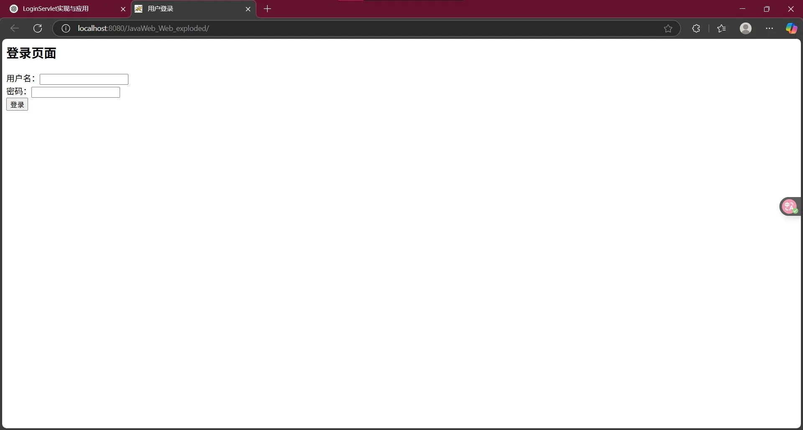
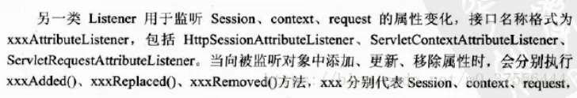
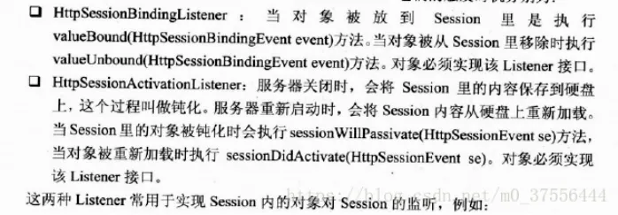
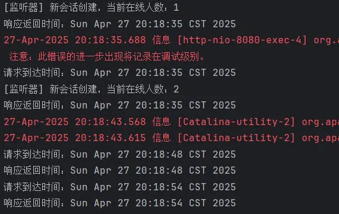
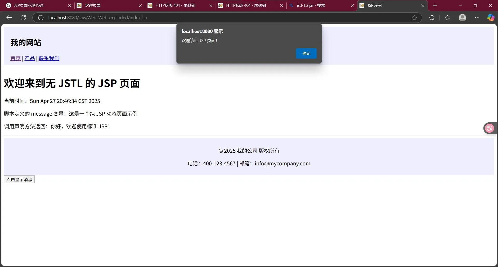
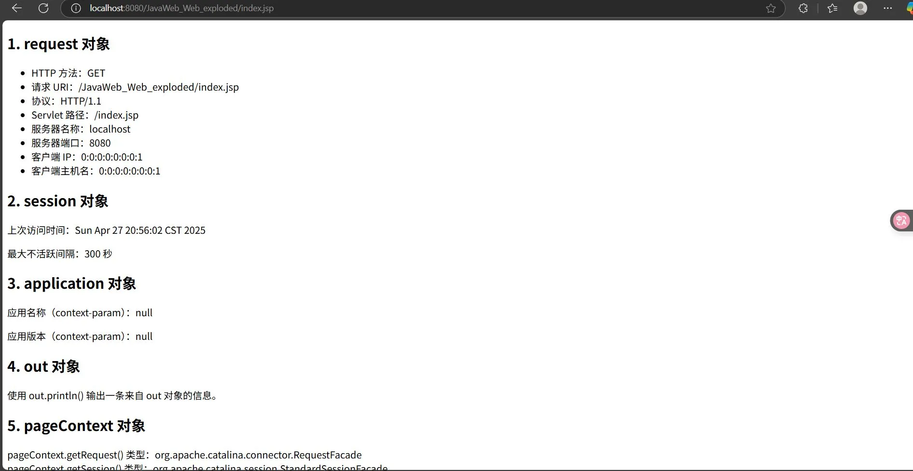
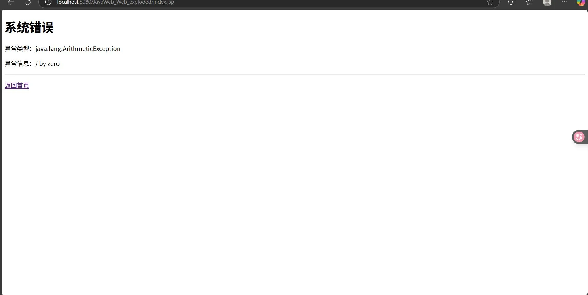
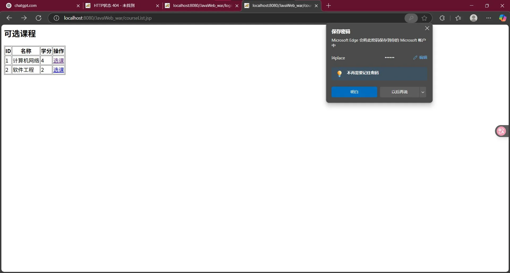
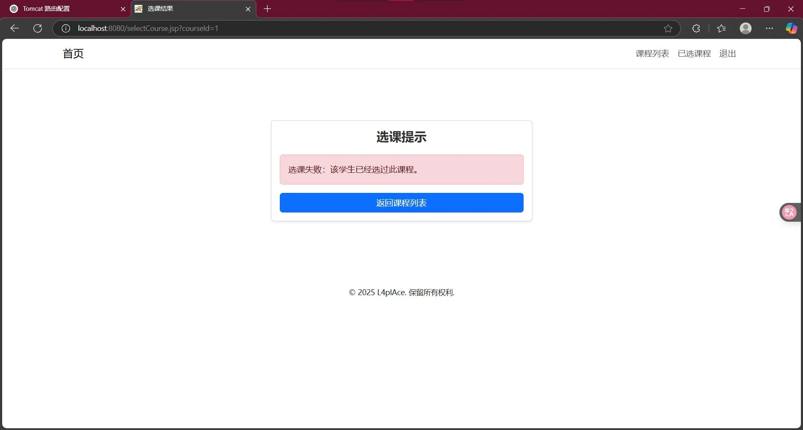

# 1. 实验一：什么是Servlet

## 什么是Servlet
Servlet（Server Applet）是运行在服务端的Java应用程序， Servlet对象主要封装了对HTTP请求的处理，它的运行需要Servlet容器的支持。Servlet可以实现用Java语言来编写业务逻辑处理HTTP请求。

## Servlet的实现
Servlet是Java语言实现的一个接口，用户编写的 Servlet 程序都必须实现 javax.servlet.Servlet 接口，该接口是 ServletAPI 的核心，在这个接口中有 5 个方法必须实现。
⑴ init()方法

⑵ service()方法

⑶ destroy()方法

⑷ getServletConfig()方法

⑸ getServletInfo()方法

实 际 上 ， Servlet 为 用 户 提 供 了 两 个 更 适 用 于 编 程 的 抽 象 类javax.servlet.GenericServlet 和 javax.servlet. http. HttpServlet，这两个抽象类间接实现了 Servlet 接口。其中，GenericServlet 抽象类实现了 Servlet 接口中除了 service()方法以外的其他所有方法；HttpServlet 抽象类则是针对 http 协议而定义的，是 GenericServlet 类的子类，它仅支持基于 http 协议的请求或响应。

## 截图


## 代码
```java
package com.l4p;  
  
import javax.servlet.http.HttpServlet;  
import javax.servlet.http.HttpServletRequest;  
import javax.servlet.http.HttpServletResponse;  
import java.io.IOException;  
import java.io.PrintWriter;  
  
/**  
 * 一个结合 HttpServletRequest 和 HttpServletResponse 的示例  
 */  
public class MySimpleHttpServlet extends HttpServlet {  
  
    @Override  
    protected void doGet(HttpServletRequest req, HttpServletResponse resp) throws IOException {  
        // 设置响应类型和编码  
        resp.setContentType("text/html;charset=UTF-8");  
  
        // 获取请求参数  
        String name = req.getParameter("name"); // 比如浏览器传 ?name=Tom  
        // 获取输出流  
        PrintWriter out = resp.getWriter();  
        out.println("<html><body>");  
  
        // 判断是否有传参数  
        if (name != null && !name.isEmpty()) {  
            out.println("<h2>Hello, " + name + "!</h2>");  
        } else {  
            out.println("<h2>Hello from MySimpleHttpServlet!</h2>");  
        }  
  
        out.println("</body></html>");  
    }  
  
    @Override  
    protected void doPost(HttpServletRequest req, HttpServletResponse resp) throws IOException {  
        // 设置响应类型和编码  
        resp.setContentType("text/html;charset=UTF-8");  
  
        // 获取请求参数  
        String username = req.getParameter("username");  
        String password = req.getParameter("password");  
  
        // 获取输出流  
        PrintWriter out = resp.getWriter();  
        out.println("<html><body>");  
  
        if (username != null && password != null) {  
            out.println("<h2>Received POST data</h2>");  
            out.println("<p>Username: " + username + "</p>");  
            out.println("<p>Password: " + password + "</p>");  
        } else {  
            out.println("<h2>No POST data received</h2>");  
        }  
  
        out.println("</body></html>");  
    }  
}
```
```java
package com.l4p;  
  
import javax.servlet.*;  
import java.io.IOException;  
import java.io.PrintWriter;  
  
public class SimpleServlet implements Servlet {  
    private ServletConfig config;  // 用于存储Servlet的配置信息  
  
    /**  
     * Servlet初始化方法，只调用一次  
     */  
    @Override  
    public void init(ServletConfig config) throws ServletException {  
        this.config = config;  
        System.out.println("[init] Servlet 初始化完成");  
    }  
  
    /**  
     * 返回Servlet配置信息  
     */  
    @Override  
    public ServletConfig getServletConfig() {  
        return config;  
    }  
  
    /**  
     * 处理请求的核心方法，每次请求都会调用  
     */  
    @Override  
    public void service(ServletRequest req, ServletResponse res) throws ServletException, IOException {  
        System.out.println("[service] 开始处理请求");  
  
        // 设置响应格式  
        res.setContentType("text/html;charset=UTF-8");  
  
        // 获取输出流，向客户端输出内容  
        PrintWriter out = res.getWriter();  
        out.println("<html><body>");  
        out.println("<h2>Hello from MyFullServlet!</h2>");  
  
        // 访问初始化参数  
        String myParam = config.getInitParameter("myParam");  
        out.println("<p>初始化参数 myParam = " + myParam + "</p>");  
  
        // 访问ServletContext全局对象  
        ServletContext context = config.getServletContext();  
        out.println("<p>应用上下文路径：" + context.getContextPath() + "</p>");  
  
        out.println("</body></html>");  
    }  
  
    /**  
     * 返回Servlet的描述信息  
     */  
    @Override  
    public String getServletInfo() {  
        return "MyFullServlet - 完整手动实现Servlet接口的示例";  
    }  
  
    /**  
     * 销毁Servlet，只在Servlet被卸载或服务器关闭时调用  
     */  
    @Override  
    public void destroy() {  
        System.out.println("[destroy] Servlet 被销毁");  
    }  
}
```


---

# 2. 实验二：Session与Cookie

## Cookie 对象
cookie用于存储用户信息，由服务器生成并发送给浏览器，浏览器将cookie以key/value的形式保存到客户机的某个文件夹中。

将一个cookie对象发送到客户端，使用response对象的addCookie()方法；

## javaWeb 四大域对象

(1) 页面域对象 (PageContext)

Page的作用范围为当前页有效，只能用于jsp页面中,是四个域对象中作用范围最小的的一个域对象。

(2) 请求域对象 (HttpServletRequest)

客户端每发送一次HTTP 请求会创建一个请求Request对象。Request的作用范围只存在当前发送的请求过程中，服务器返回响应后，生命周期结束。

(3) 会话域对象 (HttpSession)

客户端第一次访问 Web时创建一个Session对象，Session的作用范围是在用户打开游览器访问WEB的期间，览器被关闭，生命周期结束。

(4) 应用程序域对象 (ServletContext)

ServletContext是最大的Web域对象，在整个工程内有效，可以存储一些需要全局部署的配置文件，也可以存储其他信息，不过因为它的生命周期最长，是随着服务器的开启而开启，随着服务器的关闭而销毁，或者项目从服务器中移除工程而销毁。所以ServletContext中存储数据，会一直储存在内存中，少用这个对象会比较节省内存。

## 页面转发和重定向

（1） 转发可以携带当前的ServletRequest的信息，传递到下一个页面，而重定向是重新开启一次访问，不能携带。

（2） 转发上面的地址栏不会发生改变就访问了别的内容，重定向会发生改变。

（3） 转发只能存在于服务器内部，重定向可以访问任何其他的网页。

## Session与Cookie的比较

（1） cookie是存于浏览器端，而session是存于服务器端。

（2） cookie有数量和大小限制，而session没有，可以无限创建。

（3） Session和Cookie都有时效，可以对有效期进行设置。

## 截图


## 代码
```java
package com.l4p;  
  
import javax.servlet.ServletException;  
import javax.servlet.annotation.WebServlet;  
import javax.servlet.http.*;  
import javax.servlet.ServletContext;  
import java.io.IOException;  
  
@WebServlet("/login")  
public class LoginServlet extends HttpServlet {  
  
    @Override  
    protected void doPost(HttpServletRequest request, HttpServletResponse response) throws ServletException, IOException {  
        // 1. 获取客户端提交的数据  
        String username = request.getParameter("username");  
        String password = request.getParameter("password");  
  
        // 2. 简单验证（实际开发中应连接数据库）  
        if ("admin".equals(username) && "123456".equals(password)) {  
            // 登录成功处理  
  
            // 创建 Cookie 保存用户信息  
            Cookie cookie = new Cookie("username", username);  
            cookie.setMaxAge(60 * 60); // 1小时有效  
            response.addCookie(cookie);  
  
            // 使用 Session 保存用户登录状态  
            HttpSession session = request.getSession();  
            session.setAttribute("user", username);  
  
            // 使用应用域（ServletContext）统计登录人数  
            ServletContext application = getServletContext();  
            Integer loginCount = (Integer) application.getAttribute("loginCount");  
            if (loginCount == null) {  
                loginCount = 1;  
            } else {  
                loginCount = loginCount + 1;  
            }  
            application.setAttribute("loginCount", loginCount);  
  
            // 请求域（Request）保存提示信息  
            request.setAttribute("msg", "登录成功，欢迎您：" + username);  
  
            // 页面转发到 welcome.jsp            request.getRequestDispatcher("/welcome.jsp").forward(request, response);  
        } else {  
            // 登录失败处理  
  
            // 请求域保存错误提示  
            request.setAttribute("msg", "用户名或密码错误，请重新登录！");  
  
            // 页面转发回登录页  
            request.getRequestDispatcher("/login.jsp").forward(request, response);  
        }  
    }  
  
    @Override  
    protected void doGet(HttpServletRequest request, HttpServletResponse response) throws ServletException, IOException {  
        // 直接重定向到登录页面  
        response.sendRedirect(request.getContextPath() + "/login.jsp");  
    }  
}
```


---

# 3. 实验三：Servlet过滤器

## Servlet过滤器（Filter）
Servlet过滤器是从Servlet2.3规范开始新增的功能，并在Servlet2.4规范中得到增强。过滤器具有拦截客户端（浏览器）请求的功能，Servlet过滤器用于拦截客户端（浏览器）与目标资源的请求，并对这些请求进行一定过滤处理再发送给目标资源。

过滤器对象放置在javax.servlet包中，其名称为Filter，是一个接口。除了这个接口，与过滤器相关的两个接口对象：FilterConfig（一个包含Filter配置和运行环境信息的对象）和FilterChain（当前Filter链的对象）。
 

 

FilterChain接口只有一个方法doFilter(),该方法用于将过滤后的请求传给下一个过滤器，如果此过滤器已是过滤器链中的最后一个过滤器，那么请求将传送给目标资源。

## 过滤器的创建与配置

(1)创建一个Java类，实现javax.servlet.Filter接口，并实现doFilter()方法。

(2) 在web.xml文件中声明该过滤器并指定URL模式。

## 过滤器的实际应用：
（1）用户认证和授权管理。

（2）统计web应用的访问量和访问命中率，生成访问报告。

（3）实现web应用的日志处理功能。

（4）实现数据压缩功能。

（5）对传输的数据进行加密。

## Servlet监听器（Listener）接口
Servlet监听器用于监听WEB容器的有效事件，并做出相应的处理。例如，在Web应用程序启动和关闭时执行一些任务（如连接和释放数据库），或者监控Session的创建和销毁等。Servlet中的8个监听接口和6个Event类如下表：

 

HttpSessionLister、ServletContextListener、ServletRequestListener三种监听器的触发时机及使用：




HttpSessionBindingListener和HttpSessionActivationListener监听Session 内的对象。



## 创建和配置监听器
```
public class MyContextListener implements ServletContextListener {  

}  
public class MyRequestListener implements ServletRequestListener {    

}  
public class MySessionListener implements HttpSessionListener,  

        HttpSessionAttributeListener {  

}  

web.xml

<listener>      

<listener-class>servlet.listener.MySessionListener </listener-class>  

</listener>
```

## 截图




## 代码
```java
package com.l4p;  
  
import javax.servlet.*;  
import java.io.IOException;  
import java.util.Date;  
  
public class LogFilter implements Filter {  
  
    @Override  
    public void init(FilterConfig filterConfig) throws ServletException {  
        System.out.println("LogFilter 初始化完成");  
    }  
  
    @Override  
    public void doFilter(ServletRequest request, ServletResponse response, FilterChain chain)  
            throws IOException, ServletException {  
        System.out.println("请求到达时间：" + new Date());  
  
        // 继续调用下一个过滤器或者目标资源  
        chain.doFilter(request, response);  
  
        System.out.println("响应返回时间：" + new Date());  
    }  
  
    @Override  
    public void destroy() {  
        System.out.println("LogFilter 被销毁");  
    }  
}
```

```java
package com.l4p;  
  
import javax.servlet.http.HttpSessionEvent;  
import javax.servlet.http.HttpSessionListener;  
  
public class OnlineCountListener implements HttpSessionListener {  
  
    // 在线人数（注意：实际项目中应该考虑并发安全，这里为了示例简单化）  
    private static int onlineCount = 0;  
  
    @Override  
    public void sessionCreated(HttpSessionEvent se) {  
        onlineCount++;  
        System.out.println("[监听器] 新会话创建，当前在线人数：" + onlineCount);  
    }  
  
    @Override  
    public void sessionDestroyed(HttpSessionEvent se) {  
        onlineCount--;  
        System.out.println("[监听器] 会话销毁，当前在线人数：" + onlineCount);  
    }  
  
    // 提供一个公共方法，供其他地方调用  
    public static int getOnlineCount() {  
        return onlineCount;  
    }  
}
```


---

# 4. 实验四：JSP

## JSP页面可包含内容：
指令标识，HTML代码，JavaScript代码，嵌入的Java代码，JSP动作标识，注释等。

## JSP指令标识
（1） page指令：`<%@page  ……>`，是JSP最常用的指令，用于定义整个JSP页面相关的属性，这些属性在JSP被服务器解释成Servlet时会转换为相应的Java程序代码。

（2） include指令：`<%@include  ……>`，该指令可以在一个JSP页面中包含另一个JSP页面。

（3） taglib指令：`<%@taglib  ……>`，JSP页面中可以通过taglib指令标识声明该页面中所使用的标签库。

## JSP脚本标识
（1） JSP表达式：<%= 表达式%>，用于向页面输出表达式的值。

（2） 声明标识：<=! 声明变量或方法的代码%>，用于在JSP页面中声明全局的变量或方法被整个JSP页面访问。

（3） 代码片段：<%Java代码%>，在JSP页面中嵌入Java代码。

## JSP动作标识
（1） 包含文件标识：<jsp: include  ……>，用于向当前页面中包含其他文件，包含的文件可以是动态文件也可以是静态文件。

（2） 请求转发标识：<jsp: forward  ……>，用于将请求转发到其他资源，如另一个JSP页面，HTML页面，Servlet等。

（3） 传递参数标识：<jsp: param  ……>，可以作为其他标识的子标识，用于为其他标识传递参数。

## 截图



## 代码
```jsp
<%@ page language="java" contentType="text/html; charset=UTF-8" pageEncoding="UTF-8" %>  
<%@ include file="header.jsp" %>  
  
<!DOCTYPE html>  
<html lang="zh">  
<head>  
    <meta charset="UTF-8">  
    <title>JSP 示例</title>  
    <script type="text/javascript">  
        function showMessage() {  
            alert('欢迎访问 JSP 页面！');  
        }  
    </script>  
</head>  
<body>  
  
<h1>欢迎来到无 JSTL 的 JSP 页面</h1>  
  
<!-- 输出当前时间 -->  
<p>当前时间：<%= new java.util.Date() %></p>  
  
<!-- 在脚本片段中定义并设置属性 -->  
<%  
    String message = "这是一个纯 JSP 动态页面示例";  
    request.setAttribute("message", message);  
%>  
<!-- 通过表达式输出 -->  
<p>脚本定义的 message 变量：<%= message %></p>  
  
<!-- JSP 声明：全局方法 -->  
<%!  
    public String getGreeting() {  
        return "你好，欢迎使用标准 JSP！";  
    }%>  
<!-- 调用声明的方法 -->  
<p>调用声明方法返回：<%= getGreeting() %></p>  
  
<!-- JSP 动作：包含 footer.jsp --><jsp:include page="footer.jsp" />  
  
<!-- JSP 动作：请求转发，并传递参数 -->  
<%--<jsp:forward page="anotherPage.jsp">--%>  
<%--    <jsp:param name="user" value="john" />--%>  
<%--</jsp:forward>--%>  
  
<button onclick="showMessage()">点击显示消息</button>  
  
</body>  
</html>
```

```jsp
<%@ page language="java" contentType="text/html; charset=UTF-8" pageEncoding="UTF-8" %>  
<!-- header.jsp -->  
<header style="background-color: #eef; padding: 10px 20px;">  
    <h2>我的网站</h2>  
    <nav>        <a href="index.jsp">首页</a> |  
        <a href="products.jsp">产品</a> |  
        <a href="contact.jsp">联系我们</a>  
    </nav></header>  
<hr/>
```

```jsp
<%@ page language="java" contentType="text/html; charset=UTF-8" pageEncoding="UTF-8" %>  
<!-- footer.jsp -->  
<hr/>  
<footer style="background-color: #eef; padding: 10px 20px; text-align: center;">  
    <p>&copy; 2025 我的公司 版权所有</p>  
    <p>电话：400-123-4567 | 邮箱：info@mycompany.com</p>  
</footer>
```


---

# 5. 实验五：JSP内置对象

## JSP的9个内置对象：
request，response，session，application，out，pageContext，config，page，exception。

（1） request对象

获得用户请求的方式： request.getMethod()

获得发送请求的用户端的地址： request.getRequestURI()

获得请求使用的协议： request.getProtocol()

获得请求的页面文件的路径： request.getServletPath()

获得服务器名称： request.getServerName()

获得服务器的端口号： request.getServerPort()

获得客户端的 IP 地址： request.getRemoteAddr()

获得客户端的主机名： request.getRemoteHost()

（2） session对象

获取客户端最后一次会话的请求时间：session.getLastAccessedTime()

获取请求会话的有效时间：session.getMaxInactiveInterval()

以秒为单位设置session的有效时间：session.setMaxInactiveInterval()

（3） application对象用于保存所有应用的公有数据，它在服务器启动时自动创建，只有在服务器停止时才销毁。所有用户可共享application对象，类似于系统的全局变量。

application对象提供了对初始化参数的访问方法，初始化参数在web.xml文件中进行设置：

```
<context-param>

<param-name> </param-name>

<param-value> </param-value>

</context-param>
```

application.getInitParameter()方法获取web.xml文件中配置的参数

（4） out对象，向客户端浏览器输出信息，并且管理应用服务器上的输出缓冲区。

（5） pageContext对象，通过它可以获取JSP面面的request、response、session、application、exception等对象。

 


## 截图






## 代码
```jsp
<%@ page language="java"  
         contentType="text/html; charset=UTF-8"  
         pageEncoding="UTF-8"  
         errorPage="error.jsp" %>  
<%@ page import="java.util.Date" %>  
  
<%  
    // —— response 对象示例 ——// 设置一个自定义响应头  
    response.setHeader("X-Demo", "ImplicitObjects");  
  
    // —— session 对象示例 ——// 将 session 有效期设置为 5 分钟（300 秒）  
    session.setMaxInactiveInterval(300);  
%>  
  
<!DOCTYPE html>  
<html lang="zh">  
<head>  
    <meta charset="UTF-8">  
    <title>JSP 隐式对象演示</title>  
</head>  
<body>  
<h2>1. request 对象</h2>  
<ul>  
    <li>HTTP 方法：<%= request.getMethod() %></li>  
    <li>请求 URI：<%= request.getRequestURI() %></li>  
    <li>协议：<%= request.getProtocol() %></li>  
    <li>Servlet 路径：<%= request.getServletPath() %></li>  
    <li>服务器名称：<%= request.getServerName() %></li>  
    <li>服务器端口：<%= request.getServerPort() %></li>  
    <li>客户端 IP：<%= request.getRemoteAddr() %></li>  
    <li>客户端主机名：<%= request.getRemoteHost() %></li>  
</ul>  
  
<h2>2. session 对象</h2>  
<p>上次访问时间：<%= new Date(session.getLastAccessedTime()) %></p>  
<p>最大不活跃间隔：<%= session.getMaxInactiveInterval() %> 秒</p>  
  
<h2>3. application 对象</h2>  
<p>应用名称（context-param）：<%= application.getInitParameter("appName") %></p>  
<p>应用版本（context-param）：<%= application.getInitParameter("appVersion") %></p>  
  
<h2>4. out 对象</h2>  
<%  
    out.println("使用 out.println() 输出一条来自 out 对象的信息。");  
%>  
  
<h2>5. pageContext 对象</h2>  
<%  
    // 通过 pageContext 获取 request 和 session    Object req = pageContext.getRequest();  
    Object sess = pageContext.getSession();    out.println("pageContext.getRequest() 类型：" + req.getClass().getName());  
    out.println("<br/>pageContext.getSession() 类型：" + sess.getClass().getName());  
%>  
  
<h2>6. config 对象</h2>  
<p>当前 Servlet 名称：<%= config.getServletName() %></p>  
<p>通过 config.getServletContext() 再次获取 appName：<%=  
config.getServletContext().getInitParameter("appName") %></p>  
  
<h2>7. page 对象</h2>  
<p>page 对象本身：<%= page.toString() %></p>  
  
<h2>8. response 对象</h2>  
<p>当前 Content-Type：<%= response.getContentType() %></p>  
  
<h2>9. 异常触发测试（会跳转到 error.jsp）</h2>  
<%  
    // 故意制造一个除零异常，测试 exception 对象  
    int x = 1 / 0;  
%>  
  
</body>  
</html>
```

```jsp
<%@ page isErrorPage="true"  
         language="java"  
         contentType="text/html; charset=UTF-8"  
         pageEncoding="UTF-8" %>  
  
<!DOCTYPE html>  
<html lang="zh">  
<head>  
    <meta charset="UTF-8">  
    <title>发生错误</title>  
</head>  
<body>  
<h1>系统错误</h1>  
<p>异常类型：<%= exception.getClass().getName() %></p>  
<p>异常信息：<%= exception.getMessage() %></p>  
<hr/>  
<p><a href="index.jsp">返回首页</a></p>  
</body>  
</html>
```


---

# 6. 实验六：JSP表达式语言EL和JSP标准标签库（JSTL）

## **一、EL表达式**

表达式语言（Expression Language，EL）,EL表达式是用"${}"括起来的脚本，用来更方便的读取对象！EL表达式主要用来读取数据，进行内容的显示！

EL表达式主要是来对内容的显示，为了显示的方便，EL表达式提供了11个内置对象：

1. pageContext 对应于JSP页面中的pageContext对象（注意：取的是pageContext对象）

2. pageScope 代表page域中用于保存属性的Map对象

3. requestScope 代表request域中用于保存属性的Map对象

4. sessionScope 代表session域中用于保存属性的Map对象

5. applicationScope 代表application域中用于保存属性的Map对象

6. param 表示一个保存了所有请求参数的Map对象

7. paramValues表示一个保存了所有请求参数的Map对象，它对于某个请求参数，返回的是一个string[]

8. header 表示一个保存了所有http请求头字段的Map对象

9. headerValues同上，返回string[]数组

10. cookie 表示一个保存了所有cookie的Map对象

11. initParam 表示一个保存了所有web应用初始化参数的map对象

EL表达式支持简单的运算符：加减乘除取摸，逻辑运算符，三目运算符。empty运算符（判断是否为null)
## **二、JSTL标签**

JSP标准标签库（JSTL）是一个JSP标签集合，它封装了JSP应用的通用核心功能。JSTL支持通用的、结构化的任务，比如迭代，条件判断，XML文档操作，国际化标签，SQL标签。 除了这些，它还提供了一个框架来使用集成JSTL的自定义标签。

根据JSTL标签所提供的功能，可以将其分为5个类别：核心标签、格式化标签、SQL 标签、XML 标签、JSTL 函数。

1、JSTL 库安装

Apache Tomcat安装JSTL库步骤如下：

（1） 从Apache的标准标签库中下载的二进包(jakarta-taglibs-standard-current.zip)。官方下载地址：[http://archive.apache.org/dist/jakarta/taglibs/standard/binaries/](http://archive.apache.org/dist/jakarta/taglibs/standard/binaries/)

（2） 下载akarta-taglibs-standard-1.1.2.zip 包并解压，将 jakarta-taglibs-standard-1.1.2/lib/ 下的两个 jar 文件：standard.jar 和 jstl.jar 文件拷贝到 /WEB-INF/lib/ 下。

（3） 将 tld 下的需要引入的 tld 文件复制到 WEB-INF 目录下。

（4） 配置web.xml 文件如下：
```xml
<?xml version="1.0" encoding="UTF-8"?>

<web-app version="2.4"

    xmlns="http://java.sun.com/xml/ns/j2ee"

    xmlns:xsi="http://www.w3.org/2001/XMLSchema-instance"

    xsi:schemaLocation="http://java.sun.com/xml/ns/j2ee

        http://java.sun.com/xml/ns/j2ee/web-app_2_4.xsd">

    <jsp-config>

    <taglib>

    <taglib-uri>http://java.sun.com/jsp/jstl/fmt</taglib-uri>

    <taglib-location>/WEB-INF/fmt.tld</taglib-location>

    </taglib>

    <taglib>

    <taglib-uri>http://java.sun.com/jsp/jstl/fmt-rt</taglib-uri>

    <taglib-location>/WEB-INF/fmt-rt.tld</taglib-location>

    </taglib>

    <taglib>

    <taglib-uri>http://java.sun.com/jsp/jstl/core</taglib-uri>

    <taglib-location>/WEB-INF/c.tld</taglib-location>

    </taglib>

    <taglib>

    <taglib-uri>http://java.sun.com/jsp/jstl/core-rt</taglib-uri>

    <taglib-location>/WEB-INF/c-rt.tld</taglib-location>

    </taglib>

    <taglib>

    <taglib-uri>http://java.sun.com/jsp/jstl/sql</taglib-uri>

    <taglib-location>/WEB-INF/sql.tld</taglib-location>

    </taglib>

    <taglib>

    <taglib-uri>http://java.sun.com/jsp/jstl/sql-rt</taglib-uri>

    <taglib-location>/WEB-INF/sql-rt.tld</taglib-location>

    </taglib>

    <taglib>

    <taglib-uri>http://java.sun.com/jsp/jstl/x</taglib-uri>

    <taglib-location>/WEB-INF/x.tld</taglib-location>

    </taglib>

    <taglib>

    <taglib-uri>http://java.sun.com/jsp/jstl/x-rt</taglib-uri>

    <taglib-location>/WEB-INF/x-rt.tld</taglib-location>

    </taglib>

    </jsp-config>

</web-app>
```
（5） 在每个 JSP 文件中的头部包含 `<taglib>` 标签：

`<%@ taglib prefix="c" uri="http://java.sun.com/jsp/jstl/core" %>`

2、核心标签是最常用的 JSTL标签。引用核心标签库的语法如下：

|                                                                        |                                                      |
| ---------------------------------------------------------------------- | ---------------------------------------------------- |
| **标签**                                                                 | **描述**                                               |
| [<c:out>](https://www.runoob.com/jsp/jstl-core-out-tag.html)           | 用于在JSP中显示数据，就像<%= ... >                              |
| [<c:set>](https://www.runoob.com/jsp/jstl-core-set-tag.html)           | 用于保存数据                                               |
| [<c:remove>](https://www.runoob.com/jsp/jstl-core-remove-tag.html)     | 用于删除数据                                               |
| [<c:catch>](https://www.runoob.com/jsp/jstl-core-catch-tag.html)       | 用来处理产生错误的异常状况，并且将错误信息储存起来                            |
| [<c:if>](https://www.runoob.com/jsp/jstl-core-if-tag.html)             | 与我们在一般程序中用的if一样                                      |
| [<c:choose>](https://www.runoob.com/jsp/jstl-core-choose-tag.html)     | 本身只当做<c:when>和<c:otherwise>的父标签                      |
| [<c:when>](https://www.runoob.com/jsp/jstl-core-choose-tag.html)       | <c:choose>的子标签，用来判断条件是否成立                            |
| [<c:otherwise>](https://www.runoob.com/jsp/jstl-core-choose-tag.html)  | <c:choose>的子标签，接在<c:when>标签后，当<c:when>标签判断为false时被执行 |
| [<c:import>](https://www.runoob.com/jsp/jstl-core-import-tag.html)     | 检索一个绝对或相对 URL，然后将其内容暴露给页面                            |
| [<c:forEach>](https://www.runoob.com/jsp/jstl-core-foreach-tag.html)   | 基础迭代标签，接受多种集合类型                                      |
| [<c:forTokens>](https://www.runoob.com/jsp/jstl-core-foreach-tag.html) | 根据指定的分隔符来分隔内容并迭代输出                                   |
| [<c:param>](https://www.runoob.com/jsp/jstl-core-param-tag.html)       | 用来给包含或重定向的页面传递参数                                     |
| [<c:redirect>](https://www.runoob.com/jsp/jstl-core-redirect-tag.html) | 重定向至一个新的URL.                                         |
| [<c:url>](https://www.runoob.com/jsp/jstl-core-url-tag.html)           | 使用可选的查询参数来创造一个URL                                    |

## 截图


## 代码
```jsp
<%@ page language="java" contentType="text/html; charset=UTF-8" pageEncoding="UTF-8" %>  
<%  
  // 在各个域中预置几个属性，方便 EL 演示  
  pageContext.setAttribute   ("pageAttr",    "这是 pageScope 属性");  
  request.setAttribute       ("reqAttr",     "这是 requestScope 属性");  
  session.setAttribute       ("sessAttr",    "这是 sessionScope 属性");  
  application.setAttribute   ("appAttr",     "这是 applicationScope 属性");  
  // 添加一个 Cookie  javax.servlet.http.Cookie ck = new javax.servlet.http.Cookie("userCookie", "cookieValue");  
  response.addCookie(ck);%>  
  
<!DOCTYPE html>  
<html lang="zh">  
<head><meta charset="UTF-8"><title>EL 内置对象演示</title></head>  
<body>  
<h2>一、EL 内置对象</h2>  
  
<!-- pageContext -->  
<p>pageContext 对象：${pageContext}</p>  
  
<!-- 四个 Scope Map --><p>pageScope.pageAttr：${pageScope.pageAttr}</p>  
<p>requestScope.reqAttr：${requestScope.reqAttr}</p>  
<p>sessionScope.sessAttr：${sessionScope.sessAttr}</p>  
<p>applicationScope.appAttr：${applicationScope.appAttr}</p>  
  
<!-- 请求参数和参数数组 -->  
<form action="elDemo.jsp" method="get">  
  用户名：<input name="username" value="${param.username}" /><br/>  
  选项（可多选）：<br/>  
  <input type="checkbox" name="choice" value="A" /> A  
  <input type="checkbox" name="choice" value="B" /> B  
  <input type="checkbox" name="choice" value="C" /> C<br/>  
  <button type="submit">提交</button>  
</form>  
<p>param.username：${param.username}</p>  
<p>paramValues.choice：[${paramValues.choice[0]} , ${paramValues.choice[1]}]</p>  
  
<!-- Header 和 HeaderValues --><p>header['User-Agent']：${header['User-Agent']}</p>  
<p>headerValues['Accept']：${headerValues['Accept'][0]}</p>  
  
<!-- Cookie -->  
<p>cookie.userCookie.value：${cookie.userCookie.value}</p>  
  
<!-- 初始化参数 -->  
<p>initParam.siteName：${initParam.siteName}</p>  
  
<!-- 运算和逻辑 -->  
<p>算术：2 + 3 = ${2 + 3}</p>  
  
<!-- 直接用原生符号 -->  
<p>逻辑：${5 > 3 && 2 < 4}</p>  
  
<!-- 或者，使用 EL 关键字 -->  
<p>逻辑（关键字写法）：${5 gt 3 and 2 lt 4}</p>  
  
<p>三目：${empty param.username ? '未填写用户名' : '欢迎，' + param.username}</p>  
  
</body>  
</html>
```


---

# 7. 实验七：MySQL数据库与表格的创建和访问

## 1、 配置数据库环境，导入数据库

（1） 安装配置MYSQL

（2） 创建或导入数据库

（3） 加载JDBC驱动程序（拷贝mysql-connector-java-5.0.8-bin.jar文件到WebRoot\WEB-INF\lib\文件夹下）

## 2、 编写JavaBean（将单独的业务逻辑和处理封装到类中）

数据实体类：Student、Courses类的属性和数据库中的usres、courses表的各字段对应，通过对象关联表存取属性值。

数据操作类：

（1） 数据库操作抽象类：DBO，定义打开数据库连接和关闭数据库连接的方法，声明数据库中表的增、删、改、查的抽象方法。

（2） DBO 派生类：StudentADO和CoursesADO，实现对数据库中usres和courses表的增、删、改、查方法。

## 3、JAVA数据库编程

需导入的包：Java.sql

要掌握了解和熟练使用的类：Connection，DriverManager，ResultSet，Statement，PreparedStatement。

步骤：

## 4、进一步完善“学生登录选课”系统。

## 截图




## 拓展





---

